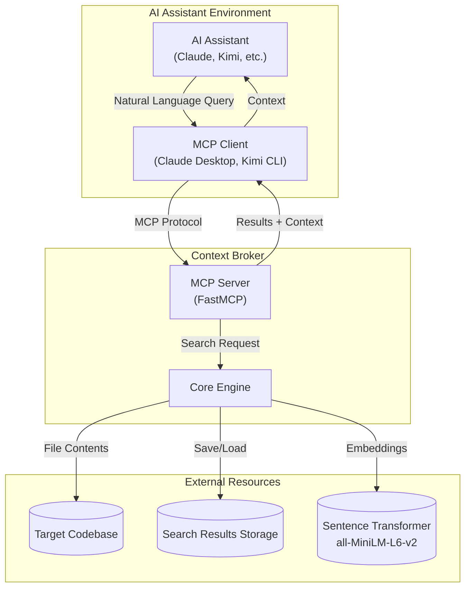
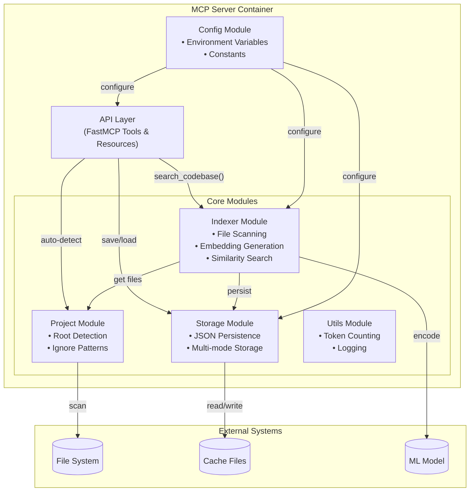
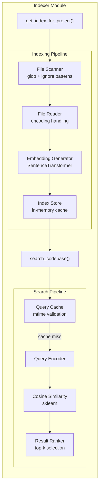
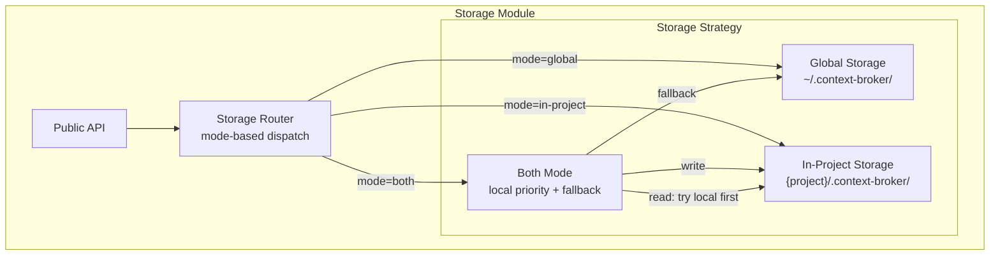
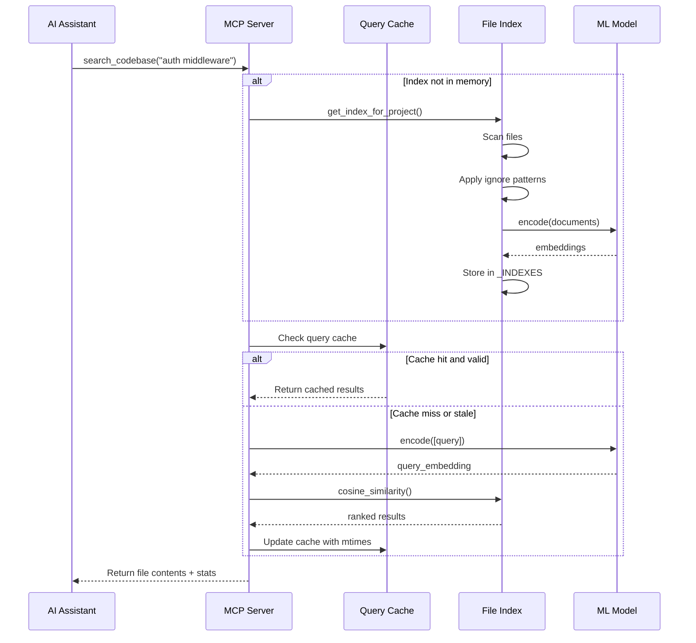
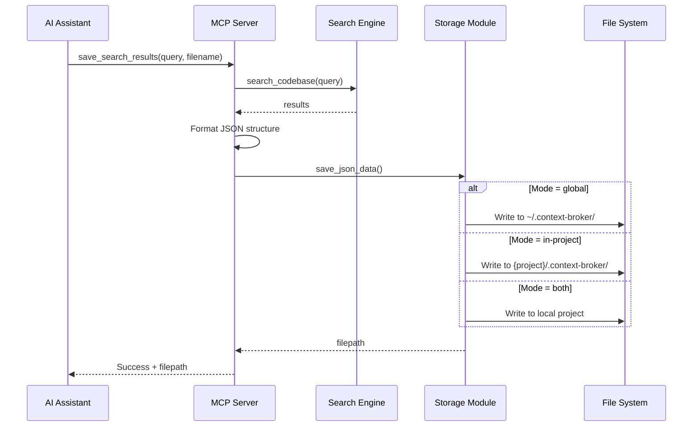
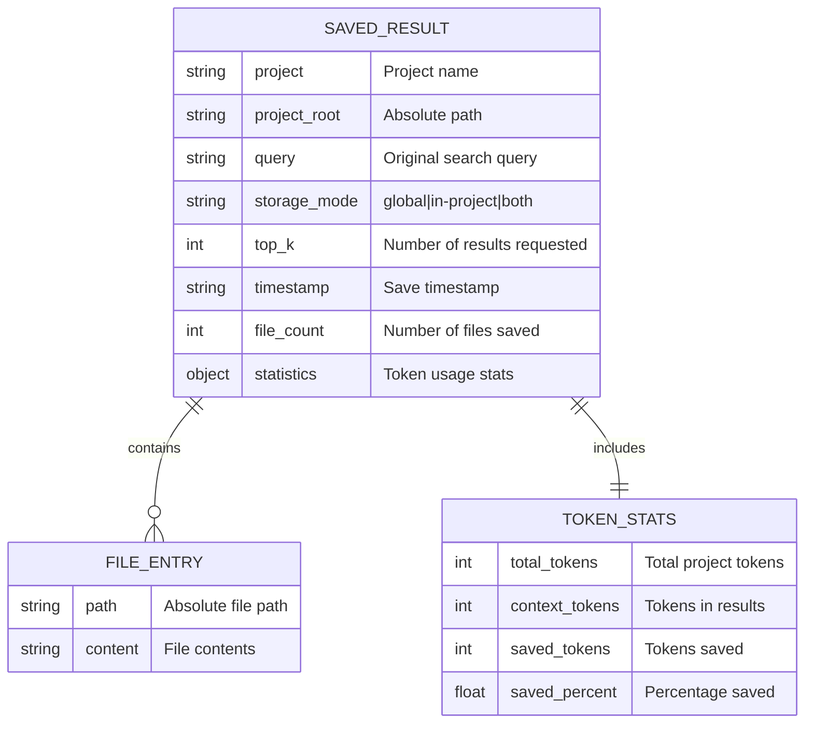
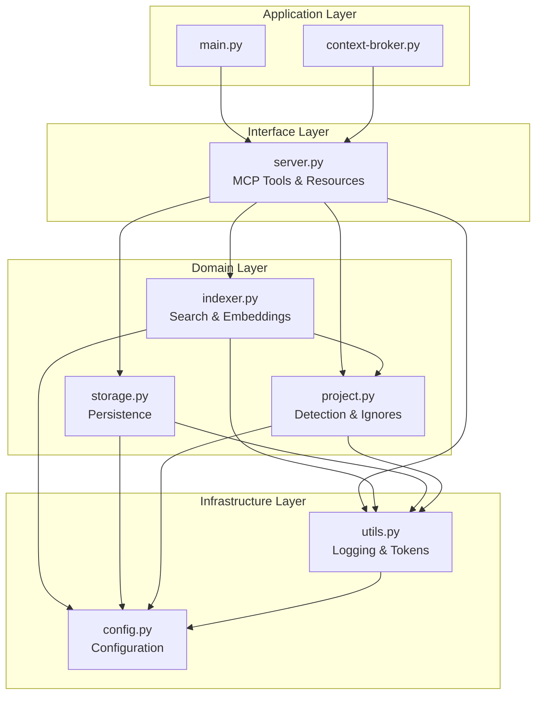
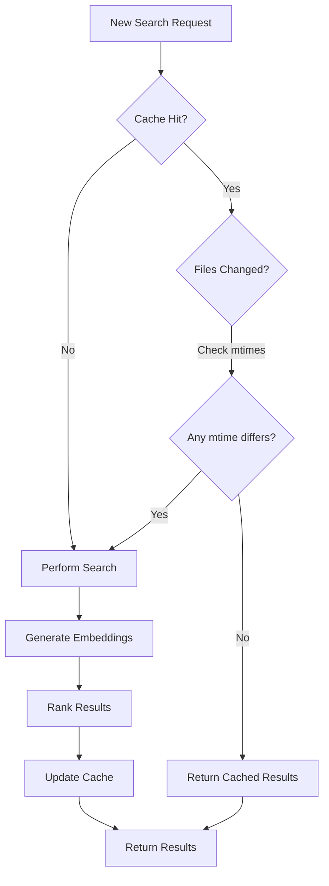

# Context Broker Architecture

## Executive Summary

Context Broker is a Model Context Protocol (MCP) server that provides semantic code search capabilities for AI assistants. It bridges the gap between natural language queries and code retrieval by using sentence transformers to understand code semantics.

**Key Architectural Decisions:**
- **Modular Design**: Separated into logical modules (config, utils, project, storage, indexer, server)
- **Dual Storage Modes**: Supports both global and in-project storage with automatic fallback
- **Intelligent Caching**: Multi-layer caching (memory + disk) with file modification tracking
- **Zero-Config Setup**: Auto-detects project roots using common markers

---

## System Context Diagram (C4 Level 1)



---

## Container Diagram (C4 Level 2)



---

## Component Diagram (C4 Level 3)

### Indexer Module



### Storage Module



---

## Data Flow Sequence Diagram

### Search Flow



### Save Results Flow



---

## Entity Relationship Diagram

### Search Result Storage Schema



---

## Module Dependencies



---

## Cache Invalidation Strategy



---

## Storage Mode Decision Matrix

| Mode | Write Location | Read Priority | Best For |
|------|---------------|---------------|----------|
| `global` | `~/.context-broker/` | Global only | CI/CD, centralized |
| `in-project` | `{project}/.context-broker/` | Local only | Team collaboration |
| `both` | Local project | Local → Global fallback | Daily development |

---

## Performance Characteristics

### Indexing Performance
- **First Search**: O(n) where n = number of files
- **Embedding Generation**: ~100-500ms per 100 files (CPU)
- **Memory Usage**: ~100MB base + ~1MB per 100 files

### Search Performance
- **Cache Hit**: <10ms
- **Cache Miss**: 50-200ms (similarity computation)
- **Token Counting**: ~1ms per KB of text

### Storage Performance
- **JSON Save**: ~10ms per file
- **JSON Load**: ~5ms per file
- **Cache Persistence**: ~50ms per 100 cache entries

---

## Security Considerations

1. **File Access**: Only reads files, never writes to source code
2. **Path Traversal**: All paths resolved using `Path.resolve()`
3. **Sensitive Data**: Respects `.gitignore` and `.dockerignore`
4. **Storage Isolation**: Project names used as directory boundaries
5. **No Code Execution**: Pure read-only analysis

---

## Extension Points

### Adding New File Types
```python
# In context_broker/config.py
SUPPORTED_EXTENSIONS.extend([
    "*.cpp", "*.hpp",  # C++
    "*.kt",            # Kotlin
    "*.swift",         # Swift
])
```

### Adding New Storage Backends
```python
# In context_broker/storage.py
class S3Storage:
    def save(self, key: str, data: dict) -> None: ...
    def load(self, key: str) -> dict: ...
```

### Custom Embedding Models
```python
# In context_broker/config.py
EMBEDDING_MODEL = "sentence-transformers/all-mpnet-base-v2"
```
