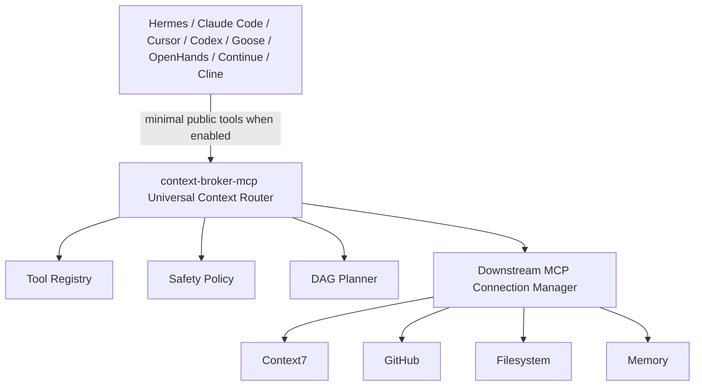

# Universal Context Router Migration

Status: Phase 1-7 runtime foundations implemented
Last updated: 2026-07-05

## Target

Evolve Context Broker from an upstream MCP server into a Universal Context Router that is both:

- an MCP server for clients such as Hermes Agent, Claude Code, Cursor, Codex CLI, Goose, OpenHands, Continue, and Cline;
- an MCP client for downstream servers such as Context7, GitHub, filesystem, memory, and future plugin-provided services.



## Completed Work

### Existing foundation preserved

- Existing FastMCP server entrypoints remain intact.
- Existing semantic code search, storage, token reporting, docs/changelog/AGENTS tools, and context backends remain registered by default.
- Existing `route_task` and `execute_selected_tool` remain backward compatible.

### Phase 1: MCP client subsystem

Implemented new TTC modules under `context_broker/client_ttc/`:

- stdio, streamable HTTP, and SSE transport adapters;
- downstream connection manager;
- bounded reconnect/backoff;
- heartbeat probe;
- capability discovery via `tools/list`, `prompts/list`, and `resources/list`;
- downstream `tools/call` dispatch;
- stdio subprocess environment filtering that avoids inheriting parent-process secrets unless explicitly configured.

### Phase 2: Universal Tool Registry

Expanded `ToolDescriptor` and `ToolRegistry` while preserving the old constructor/cache shape:

- added `server`, `embedding`, `latency_ms`, `capabilities`, and public `risk` compatibility field;
- preserved existing `risk_level`, tags, permissions, and capability booleans;
- added SQLite fallback cache at `.cache/ucr-tool-registry.sqlite3`;
- kept local JSON cache compatibility at `.cache/token-slim-router-tools.json`;
- added optional Redis cache when `redis_url` is explicitly configured;
- added downstream MCP capability ingestion through `ingest_downstream_capabilities()`.

### Phase 3: Semantic Routing

Enhanced `route_task()` with UCR payloads:

- explicit intent detection (`ucr.intent.v1`);
- lightweight skill-aware decomposition steps;
- descriptor ranking against the expanded registry;
- top-k and token-budget selection;
- planner output with versioned plan schema (`ucr.plan.v1`);
- planning cache keyed by task, mode, token budget, top-k, and registry fingerprint.

### Phase 4: Dynamic Tool Exposure

Added the target public UCR tools:

- `route_task`
- `execute_plan`
- `search_context`
- `explain_plan`

Backward compatibility remains the default. Minimal public tool exposure can be enabled with:

```bash
CONTEXT_BROKER_UCR_PUBLIC_SURFACE_ONLY=1
```

When enabled, server assembly registers the router public surface instead of the legacy full tool set.

### Phase 5: Safety

Expanded router safety:

- prompt-injection checks;
- path traversal checks;
- secret filename and secret-like argument detection;
- dangerous shell command checks;
- medium/high-risk confirmation requirements;
- recursive redaction for secret-like arguments/results;
- safety-gated `execute_plan()` over DAG nodes.

### Phase 6: Performance

Added runtime performance foundations:

- descriptor vector cache;
- local JSON + SQLite tool cache;
- optional Redis tool cache;
- planning cache;
- parallel-safe planner stages;
- downstream manager parallel `connect_all`, `discover_all`, and `heartbeat_all`;
- lazy default registry loading.

### Phase 7: Observability

Added lightweight observability primitives:

- route/execution counters;
- blocked and confirmation counters;
- cache hit/miss counters;
- latency samples;
- `get_route_metrics` MCP tool;
- `benchmark_router` MCP tool;
- `benchmark_route_task()` public API.

## Verification

- Baseline before migration work: `uv run pytest -q` → `166 passed`.
- After Phase 1: `uv run pytest -q` → `170 passed`.
- After Phase 2-7 runtime foundations: focused UCR tests pass.

Focused commands:

```bash
uv run pytest tests/test_token_slim_router.py tests/test_downstream_mcp_client.py tests/test_ucr_runtime.py -q
uv run ruff check context_broker/router_ttc context_broker/client_ttc context_broker/server_ttc/tasks/router_tasks.py tests/test_token_slim_router.py tests/test_downstream_mcp_client.py tests/test_ucr_runtime.py
```

## Decisions

- Preserve TTC architecture: new client subsystem is isolated under `client_ttc`; routing remains under `router_ttc`.
- Prefer adapters over rewrites: existing router and server APIs are unchanged unless minimal exposure is explicitly enabled.
- Keep downstream transports optional at import time: MCP SDK imports are lazy inside the transport adapter.
- Do not inherit parent-process secrets into stdio downstream servers unless explicitly configured.
- Use built-in lexical vectors as the always-available semantic fallback; heavier embedding-backed ranking can be added without changing public contracts.
- Keep Redis optional and SQLite local-first so stdio users do not need infrastructure.

## Remaining Work / Hardening

These are production-hardening tasks, not blockers for the phase foundations:

- Add config/env parsing for downstream MCP server definitions.
- Add integration tests with real stdio/HTTP/SSE MCP test servers.
- Add durable audit log storage for policy decisions.
- Add streaming result propagation through FastMCP once downstream execution is wired to live configured servers.
- Add richer embedding model integration for descriptor search while retaining lexical fallback.
- Add adapter example files for Hermes Agent, Claude Code, Codex CLI, Cursor, Goose, OpenHands, Continue, and Cline.

## Risks

- Some MCP SDK transport APIs may change; the adapter layer confines that risk to `transport_tools.py`.
- Dynamic public-tool reduction can surprise existing users if enabled without documentation; it remains opt-in.
- Redis registry persistence depends on the optional `redis` package and a reachable Redis server.
- Downstream tool outputs can contain secrets; redaction exists but should be expanded with structured content-type awareness.

## Rollback Strategy

- Unset `CONTEXT_BROKER_UCR_PUBLIC_SURFACE_ONLY` to restore the full legacy MCP tool surface.
- Remove or disable downstream server configs; the router continues with built-in descriptors and local tools.
- Delete `.cache/ucr-tool-registry.sqlite3` and `.cache/token-slim-router-tools.json` to rebuild the registry cache.
- Revert `context_broker/client_ttc/` and `context_broker/router_ttc/` changes independently because server assembly only depends on router registration.

## Future Improvements

- Config file/env loader for downstream MCP server definitions.
- Registry ingestion job that periodically refreshes downstream capabilities.
- Adapter examples for Hermes Agent, Claude Code, Codex CLI, Cursor, Goose, OpenHands, Continue, and Cline.
- RFC-backed schema definitions published as JSON Schema for route plans, exposure sets, and execution results.
