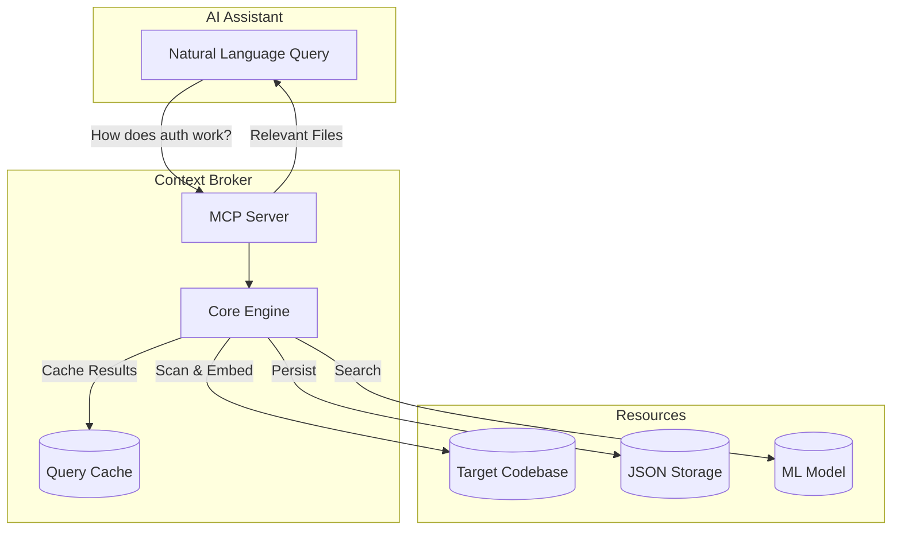
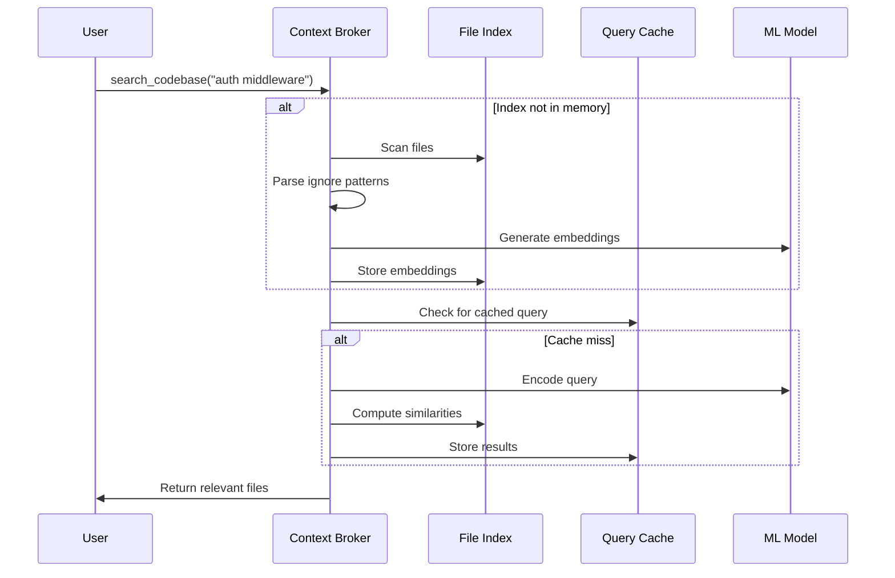

# Context Broker MCP Server

A Model Context Protocol (MCP) server that provides semantic search capabilities for codebases. Uses sentence transformers to understand code meaning and find relevant files based on natural language queries.

## Features

- 🔍 **Semantic Code Search** - Find code by describing what you need in plain English
- 🎯 **Auto Project Detection** - Automatically detects project roots from common markers
- 💾 **Smart Caching** - Caches embeddings and results with file modification tracking
- 📊 **Token Efficiency** - Reports token usage and savings for each query
- 🚫 **Respects Ignore Files** - Reads `.gitignore` and `.dockerignore` to exclude unwanted files
- 💾 **Persistent Search Results** - Save and load search results across sessions
- ⚡ **Fast Inference** - Uses CPU-optimized sentence transformers for quick searches
- 🏗️ **Modular Architecture** - Clean, extensible codebase following best practices

## Quick Start

### Prerequisites

- Python 3.13+
- UV package manager

### Installation

```bash
# Clone the repository
git clone <repo-url>
cd context-broker

# Install dependencies
uv sync

# Or with pip
pip install -e .
```

## Understanding MCP Client Output

When using Context Broker with MCP clients (Claude Desktop, Kimi CLI, etc.), you'll see:

### Tool Call Notifications (Client-Side)

Lines like these are shown by the MCP client, not the server:
```
• Used search_codebase_tool ({"query": "tracing::debug...", "project_root": "/path/to/project"})
• Used auto_search ({})
```

These are **automatically displayed by the client** when tools are called. The Context Broker server also sends progress notifications so you can track:
- When a search starts
- Which project root was detected
- How many files were found
- Token efficiency statistics

### Token Efficiency Reports (Server Response)

These lines are included in the tool response:
```
📈 Token Efficiency Report:
   • Total Project Tokens: 50,000
   • Context Sent: 3,500
   • Tokens Saved: 46,500 (93.0%)
```

## Running the Server

### Using UV (Recommended)

```bash
# From the project directory
uv run python context-broker.py

# Or using the module entry point
uv run python -m context_broker

# Or using the convenience script
uv run main.py
```

### Using Python directly

```bash
# Make sure dependencies are installed first
pip install fastmcp sentence-transformers scikit-learn numpy torch tiktoken

# Run the main entry point
python context-broker.py

# Or using the module
python -m context_broker

# Or the alternative entry
python main.py
```

### MCP Client Configuration

Add to your MCP client (Claude Desktop, Kimi CLI, etc.):

#### Claude Desktop

Edit `~/Library/Application Support/Claude/claude_desktop_config.json` (macOS) or equivalent:

**Using UV:**
```json
{
  "mcpServers": {
    "context-broker": {
      "command": "uv",
      "args": ["run", "--with", "fastmcp", "python", "/full/path/to/context-broker/context-broker.py"],
      "env": {
        "CONTEXT_BROKER_PROJECT_ROOT": "/path/to/your/project"
      }
    }
  }
}
```

**Using Python directly:**
```json
{
  "mcpServers": {
    "context-broker": {
      "command": "python",
      "args": ["/full/path/to/context-broker/context-broker.py"],
      "env": {
        "CONTEXT_BROKER_PROJECT_ROOT": "/path/to/your/project"
      }
    }
  }
}
```

#### Kimi CLI

Add to your Kimi CLI configuration file:

```json
{
  "mcpServers": {
    "context-broker": {
      "command": "uv",
      "args": ["run", "--with", "fastmcp", "python", "/full/path/to/context-broker/context-broker.py"]
    }
  }
}
```

### Testing the Server

To verify the server is working:

```bash
# Run in one terminal
uv run python context-broker.py

# The server will start and listen for MCP protocol messages on stdin/stdout
# You should see output like:
# [Broker] ⚡ Indexing new project: /your/project/path
# [Broker] ✅ Index ready. Total size: X tokens.
```

## Architecture Overview



For detailed architecture, see [ARCHITECTURE.md](ARCHITECTURE.md).

## Usage

### Available Tools

| Tool | Description |
|------|-------------|
| `search_codebase(query, project_root?)` | Search codebase using semantic similarity |
| `auto_search(project_root?)` | Auto-search for entry points and configuration |
| `save_search_results(query, filename, subdir?)` | Save search results to JSON |
| `list_saved_results(project_name, subdir?)` | List saved JSON files |
| `load_saved_results(project_name, filename, subdir?)` | Load saved search results |
| `get_storage_config()` | Show storage configuration |

### Available Resources

| Resource | Description |
|----------|-------------|
| `codebase://auto-context` | Auto-provides context on every request |

### Example Queries

```
"Find authentication middleware"
"Show me database connection code"  
"Where is the user model defined?"
"Main entry point configuration"
```

## Configuration

### Environment Variables

| Variable | Description | Default |
|----------|-------------|---------|
| `CONTEXT_BROKER_PROJECT_ROOT` | Default project root | Auto-detected |
| `CONTEXT_BROKER_DEFAULT_QUERY` | Default auto-context query | `"main entry point configuration setup"` |
| `CONTEXT_BROKER_STORAGE_MODE` | Storage mode: `global`, `in-project`, or `both` | `both` |
| `CONTEXT_BROKER_STORAGE_DIR` | Base directory for global storage | `~/.context-broker` |

### Storage Modes

The MCP server supports three storage modes for saving JSON search results:

#### 1. Both Mode (Default) ⭐ Recommended

Uses both storage locations, **preferring local project storage**.

**Behavior:**
- **Save:** Always saves to local project folder (`.context-broker/`)
- **Load:** Checks local project first, falls back to global if not found
- **List:** Shows files from both locations

```
/path/to/my-api-project/              ~/.context-broker/
├── src/                              └── my-api-project/
├── .context-broker/                      ├── api/
│   └── api/                              │   └── old-results.json
│       └── auth-middleware.json          └── config/
└── package.json                              └── database.json
```

**Best for:** Daily development with multiple projects, keeping results with your code while maintaining a global backup.

#### 2. Global Mode

Stores all project data in a centralized location:

```
~/.context-broker/
├── my-api-project/
│   ├── api/
│   │   └── auth-middleware.json
│   └── config/
│       └── database.json
```

**Best for:** Centralized management, CI/CD environments, not cluttering project directories.

#### 3. In-Project Mode

Stores data within each project's directory:

```
/path/to/my-api-project/
├── src/
├── .context-broker/
│   └── api/
│       └── auth-middleware.json
└── package.json
```

**Best for:** Team collaboration (commit results to git), sharing context with teammates.

## How It Works

### Data Flow



### Key Components

1. **Project Detection**: Scans for markers like `.git`, `package.json`, `pyproject.toml` to find project root
2. **File Indexing**: Indexes supported files (`.py`, `.js`, `.ts`, `.go`, `.rs`, `.java`, etc.)
3. **Respect Ignores**: Reads `.gitignore` and `.dockerignore` to skip excluded files
4. **Semantic Embedding**: Embeds files using `all-MiniLM-L6-v2` model
5. **Similarity Search**: Finds most relevant files for your query using cosine similarity
6. **Caching**: Stores results with file mtimes for fast repeat queries

## Project Structure

```
context-broker/
├── context_broker/           # Modular package
│   ├── __init__.py          # Package init
│   ├── config.py            # Configuration constants
│   ├── utils.py             # Logging & utilities
│   ├── project.py           # Project detection
│   ├── storage.py           # JSON persistence
│   ├── indexer.py           # Search & embeddings
│   └── server.py            # MCP implementation
├── context-broker.py        # Main entry point
├── main.py                  # Alternative entry
├── pyproject.toml           # Project config
├── README.md                # This file
├── Usage.md                 # Detailed usage guide
├── ARCHITECTURE.md          # Architecture docs
└── CONTRIBUTING.md          # Contribution guide
```

## Supported File Types

- **Languages**: Python, JavaScript, TypeScript, Go, Rust, Java, HTML, CSS, Shell, SQL
- **Config**: JSON, TOML, YAML, XML, Properties, Gradle
- **Docs**: Markdown

## Ignored Directories

Always excluded: `node_modules`, `.git`, `dist`, `__pycache__`, `.venv`, `target`, `build`, `bin`, `out`, `.gradle`, `.idea`, `.vscode`, and more.

## Documentation

- [Usage Guide](Usage.md) - Comprehensive usage documentation including:
  - Detailed configuration options
  - Use cases and workflows
  - Tool examples
  - Best practices
  - Troubleshooting
  
- [Architecture](ARCHITECTURE.md) - Technical architecture:
  - C4 diagrams
  - Data flow
  - Module dependencies
  - Performance characteristics
  
- [Contributing](CONTRIBUTING.md) - Developer guide:
  - Development setup
  - Code style
  - Adding features
  - Testing

## Module Overview

| Module | Lines | Purpose |
|--------|-------|---------|
| `config.py` | ~200 | Environment variables, constants, configuration |
| `utils.py` | ~100 | Logging, token counting, path utilities |
| `project.py` | ~300 | Project root detection, ignore pattern parsing |
| `storage.py` | ~250 | Multi-mode JSON persistence |
| `indexer.py` | ~400 | File indexing, embeddings, search |
| `server.py` | ~450 | MCP tools, resources, prompts |

## Performance

- **First Search**: 1-5 seconds (depending on codebase size)
- **Subsequent Searches**: <100ms (cached embeddings)
- **Memory Usage**: ~100MB base + ~1MB per 100 files
- **Token Efficiency**: Typically saves 80-95% of tokens vs. sending entire codebase

## Contributing

We welcome contributions! Please see [CONTRIBUTING.md](CONTRIBUTING.md) for guidelines.

## License

[Add your license here]

---

**Built with ❤️ for developers who love context-aware AI.**
