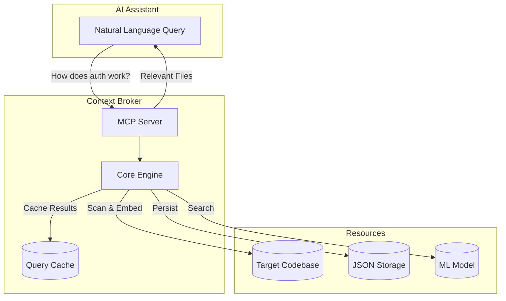
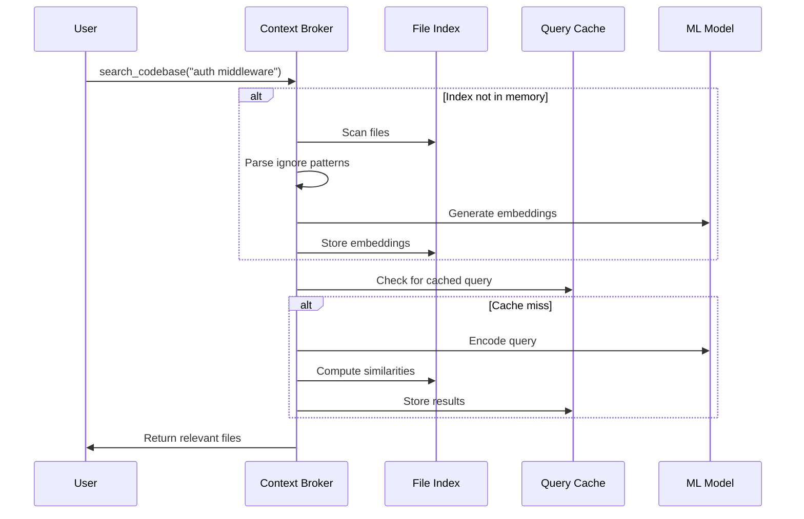

# Context Broker MCP Server

A Model Context Protocol (MCP) server that provides semantic search capabilities for codebases. Uses sentence transformers to understand code meaning and find relevant files based on natural language queries.

## Models

Context Broker uses **one local ML model** — an embedding model, not a chat/LLM:

| Component | Model | Purpose | Configurable? |
|-----------|-------|---------|--------------|
| Embedding | `all-MiniLM-L6-v2` (sentence-transformers) | Converts code into vector embeddings for semantic search | Yes — `CONTEXT_BROKER_EMBEDDING_MODEL` |
| Tokenizer | `cl100k_base` (tiktoken) | Estimates token counts for efficiency reports | No |

**Key points:**
- The embedding model runs **locally on CPU** by default (set `CONTEXT_BROKER_DEVICE=cuda` or `mps` for GPU)
- **No LLM or chat model is used** — Context Broker is a search/indexing tool, not a generative AI
- Embedding models download automatically on first use and are cached by Sentence Transformers
- Local-only mode (`CONTEXT_BROKER_LOCAL_ONLY=1`) tries the cache first, then performs one
  announced bootstrap download if the configured model is missing
- Explicit `HF_HUB_OFFLINE=1` or `TRANSFORMERS_OFFLINE=1` settings disable automatic downloads
- The model is lazy-loaded and auto-unloaded after 15 minutes of inactivity

### Using a Different Embedding Model

Any model compatible with the `sentence-transformers` library works. Popular alternatives:

| Model | Quality | Speed | Size |
|-------|---------|-------|------|
| `all-MiniLM-L6-v2` (default) | Good | Fast | ~80 MB |
| `all-mpnet-base-v2` | Better | Slower | ~420 MB |
| `paraphrase-MiniLM-L3-v2` | Lower | Fastest | ~60 MB |

Set via environment variable:
```bash
CONTEXT_BROKER_EMBEDDING_MODEL=all-mpnet-base-v2
```

On first use, Context Broker names the configured model in its MCP log and downloads it
automatically when it is not already cached. This bootstrap also applies when
`CONTEXT_BROKER_LOCAL_ONLY=1`; subsequent loads use the local cache.

### Optional LLM Configuration

Context Broker exposes optional LLM environment variables that **have no built-in effect yet**. They are available so MCP clients and future tools can discover what LLM endpoint to use. Set them in your `.env` or MCP client config:

| Variable | Example | Purpose |
|----------|---------|---------|
| `CONTEXT_BROKER_LLM_MODEL` | `llama3`, `gpt-4o` | LLM model identifier |
| `CONTEXT_BROKER_LLM_BASE_URL` | `http://localhost:11434/v1` | API endpoint (Ollama, OpenAI-compatible, etc.) |
| `CONTEXT_BROKER_LLM_API_KEY` | `sk-...` | API key (leave empty for local models) |

These values are reported by the `get_storage_config` tool so MCP clients can read them at runtime.

Example with Ollama:
```json
{
  "mcpServers": {
    "context-broker": {
      "command": "uv",
      "args": ["run", "python", "/path/to/context-broker.py"],
      "env": {
        "CONTEXT_BROKER_LLM_MODEL": "llama3",
        "CONTEXT_BROKER_LLM_BASE_URL": "http://localhost:11434/v1"
      }
    }
  }
}
```

## Features

- 🔍 **Semantic Code Search** — Find code by describing what you need in plain English
- 🎯 **Auto Project Detection** — Automatically detects project roots from common markers
- 💾 **Smart Caching** — Caches embeddings and results with file modification tracking
- 📊 **Token Efficiency** — Reports token usage and savings for each query
- 🚫 **Respects Ignore Files** — Reads `.gitignore` and `.dockerignore` to exclude unwanted files
- 💾 **Persistent Search Results** — Save and load search results across sessions
- ⚡ **Fast Inference** — CPU-optimized sentence transformers for quick searches
- 🗄️ **Cross-Chat Context Backend** — Honcho or Redis (via `CONTEXT_BROKER_CONTEXT_BACKEND`)
- 📝 **Chat History Persistence** — Dual-written to context backend + local JSON ledger
- 🔐 **Chat-Payload Cache** — Redis TTL-based read-through cache with auto-warm on save
- 👤 **User Activity Tracking** — Per-user `first_seen` / `last_seen` / `request_count` + audit log
- 🌐 **Web Dashboard** — Starlette app to browse projects → sessions → messages
- 🔄 **Session Management** — `record_turn`, `record_session`, `load_cross_session_context` MCP tools
- 🔌 **Downstream MCP Client Foundation** — stdio, streamable HTTP, and SSE connection manager for Universal Context Router integrations
- 📜 **Auto CHANGELOG** — Generated from conventional commits
- 📄 **Auto AGENTS.md** — Generated and validated per project
- 📖 **Auto Feature Docs** — Documentation generated from feature changes
- 🧭 **Token-Slim MCP Router** — Client-agnostic task router that exposes only relevant tools, builds a simple DAG, and blocks unsafe execution
- 🏗️ **Modular Architecture** — TTC (Tool-Task-Codebase) folder isolation pattern

## Quick Start

### Prerequisites

- Python 3.13+
- UV package manager

### Installation

```bash
# Clone the repository
git clone https://github.com/InSelfControll/context-broker-mcp.git
cd context-broker

# Install dependencies
uv sync

# Or with pip
pip install -e .
```

## Understanding MCP Client Output

When using Context Broker with MCP clients (Claude Desktop, Kimi CLI, etc.), you'll see:

### Tool Call Notifications (Client-Side)

Lines like these are shown by the MCP client, not the server:
```
• Used search_codebase_tool ({"query": "tracing::debug...", "project_root": "/path/to/project"})
• Used auto_search ({})
```

These are **automatically displayed by the client** when tools are called. The Context Broker server also sends progress notifications so you can track:
- When a search starts
- Which project root was detected
- How many files were found
- Token efficiency statistics

### Token Efficiency Reports (Server Response)

These lines are included in the tool response:
```
📈 Token Efficiency Report:
   • Total Project Tokens: 50,000
   • Context Sent: 3,500
   • Tokens Saved: 46,500 (93.0%)
```

## Running the Server

### Using UV (Recommended)

```bash
# From the project directory
uv run python context-broker.py

# Or using the module entry point
uv run python -m context_broker

# Or using the convenience script
uv run main.py
```

### Using Python directly

```bash
# Make sure dependencies are installed first
pip install fastmcp sentence-transformers scikit-learn numpy torch tiktoken

# Run the main entry point
python context-broker.py

# Or using the module
python -m context_broker

# Or the alternative entry
python main.py
```

### MCP Client Configuration

Add to your MCP client (Claude Desktop, Kimi CLI, etc.):

#### Claude Desktop

Edit `~/Library/Application Support/Claude/claude_desktop_config.json` (macOS) or equivalent:

**Using UV:**
```json
{
  "mcpServers": {
    "context-broker": {
      "command": "uv",
      "args": ["run", "--with", "fastmcp", "python", "/full/path/to/context-broker/context-broker.py"],
      "env": {
        "CONTEXT_BROKER_PROJECT_ROOT": "/path/to/your/project"
      }
    }
  }
}
```

**Using Python directly:**
```json
{
  "mcpServers": {
    "context-broker": {
      "command": "python",
      "args": ["/full/path/to/context-broker/context-broker.py"],
      "env": {
        "CONTEXT_BROKER_PROJECT_ROOT": "/path/to/your/project"
      }
    }
  }
}
```

#### Kimi CLI

Add to your Kimi CLI configuration file:

```json
{
  "mcpServers": {
    "context-broker": {
      "command": "uv",
      "args": ["run", "--with", "fastmcp", "python", "/full/path/to/context-broker/context-broker.py"]
    }
  }
}
```

### Testing the Server

To verify the server is working:

```bash
# Run in one terminal
uv run python context-broker.py

# The server will start and listen for MCP protocol messages on stdin/stdout
# You should see output like:
# [Broker] ⚡ Indexing new project: /your/project/path
# [Broker] ✅ Index ready. Total size: X tokens.
```

## Architecture Overview


```mermaid
flowchart TB
    subgraph "AI Assistant"
        AI["Natural Language Query"]
    end
    
    subgraph "Context Broker"
        MCP["MCP Server"]
        Core["Core Engine"]
        Cache[(Query Cache)]
    end
    
    subgraph "Resources"
        Codebase[(Target Codebase)]
        Storage[(JSON Storage)]
        Model[(ML Model)]
    end
    
    AI -->|"How does auth work?"| MCP
    MCP --> Core
    Core -->|"Scan & Embed"| Codebase
    Core -->|"Search"| Model
    Core -->|"Cache Results"| Cache
    Core -->|"Persist"| Storage
    MCP -->|"Relevant Files"| AI
```

For detailed architecture, see [ARCHITECTURE.md](ARCHITECTURE.md).

## Usage

### Available Tools

| Tool | Description |
|------|-------------|
| `search_codebase(query, project_root?)` | Search codebase using semantic similarity |
| `auto_search(project_root?)` | Auto-search for entry points and configuration |
| `save_search_results(query, filename, subdir?)` | Save search results to JSON |
| `list_saved_results(project_name, subdir?)` | List saved JSON files |
| `load_saved_results(project_name, filename, subdir?)` | Load saved search results |
| `get_storage_config()` | Show storage configuration |
| `token_counter(project_root?)` | Get latest token usage for editor integrations |
| `token_history(project_root?, limit?)` | Graph-ready token savings history |
| `token_integration_manifest(project_root?)` | Integration options for GraphQL, LangGraph, etc. |
| `route_task(task, mode?, token_budget?, top_k?)` | Recommend a minimal task-specific tool slice; modes: `plan_only`, `recommend_tools`, `execute_safe` |
| `execute_plan(plan_json, arguments_by_tool_json?, confirmed?)` | Execute or delegate a routed UCR plan through safety gates |
| `search_context(query, project_root?, top_k?)` | Search relevant project context through the UCR public surface |
| `explain_plan(plan_json)` | Explain a UCR plan in client-neutral JSON |
| `execute_selected_tool(tool_id, arguments_json?, confirmed?)` | Safety-gated execution/delegation for a selected router tool |
| `get_route_metrics()` | Return UCR route/execution/cache/latency metrics |
| `benchmark_router(iterations?)` | Run a lightweight in-process router benchmark |
| `save_chat_context(session_id, user_message, assistant_message, ...)` | Save chat messages to the context backend (Honcho or Redis) |
| `load_chat_context(session_id, tokens?, summary?, search_query?, ...)` | Load cross-chat context from the configured backend |
| `record_turn(session_id, user_message, assistant_message, ...)` | Save one user-assistant exchange |
| `record_session(session_id, turns, ...)` | Bulk-persist an entire conversation |
| `context_backend_status()` | Show configured cross-chat context backend status |
| `load_cross_session_context(search_query?, top_k?, ...)` | Search across all sessions (Redis only) |
| `list_user_activity(peer_id?, limit?)` | Per-user activity audit (Redis only) |
| `ensure_agents_md_tool(project_root?)` | Ensure AGENTS.md exists for a project |
| `validate_agents_md_tool(project_root?)` | Validate AGENTS.md quality |
| `generate_agents_md_tool(project_root?, force?)` | Generate AGENTS.md for a project |
| `scan_projects_for_agents_md(project_root?, max_depth?)` | Scan for projects missing AGENTS.md |
| `ensure_changelog_tool(project_root?)` | Ensure CHANGELOG.md exists and is up to date |
| `validate_changelog_tool(project_root?)` | Validate CHANGELOG.md against git history |
| `generate_version_changelog(version, project_root?, since?)` | Generate a changelog section for a version |
| `get_changelog_stats_tool(project_root?)` | Get statistics about CHANGELOG.md |
| `ensure_feature_docs_tool(project_root?, since?)` | Ensure docs exist for recent feature changes |
| `scan_missing_docs_tool(project_root?, since?)` | Scan for feature changes missing documentation |
| `get_docs_stats_tool(project_root?)` | Get statistics about feature documentation |

### Available Resources

| Resource | Description |
|----------|-------------|
| `codebase://auto-context` | Auto-provides context on every request |
| `codebase://token-counter` | Provides latest token metrics for editor dashboards |

Token counter reports are also persisted as internal JSON under broker storage
(in-project path: `.context-broker/_internal/token-counter-latest.json`), and
that storage is excluded from semantic indexing so it is not forwarded as code context.

### Token-Slim Router

`route_task` is a production-oriented MCP router API for Claude Code, Codex CLI,
Cursor, Hermes Agent, and other MCP clients. Instead of exposing every server tool
by default, the router ranks a registry of tool descriptors against the current
task, applies a token budget, and returns only the tools that should be visible.

Router modes:

- `recommend_tools` — return ranked tool descriptors and token-savings metrics.
- `plan_only` — also return a dependency-ordered DAG without executing anything.
- `execute_safe` — prepare a safety-gated execution path; unknown tools are
  delegated back to the client runtime instead of executed blindly.

The router registry stores descriptor vectors in `.cache/token-slim-router-tools.json`.
Safety checks block prompt-injection text, path traversal, secret-like arguments,
secret filenames, and dangerous shell commands. High-risk and shell-capable tools
require explicit confirmation.

### Universal Context Router Migration

Context Broker is being migrated incrementally into a Universal Context Router:
an upstream MCP server and a downstream MCP client. The downstream client
subsystem is isolated under `context_broker/client_ttc/` and supports stdio,
streamable HTTP, and SSE MCP transports, bounded reconnect, heartbeat probes,
capability discovery (`tools/list`, `prompts/list`, `resources/list`), and
downstream `tools/call` dispatch.

The UCR runtime adds an expanded tool registry with JSON, SQLite, and optional
Redis cache; downstream capability ingestion; intent detection; skill-aware
decomposition; DAG planning with parallel-safe stages; safety-gated plan
execution; secret redaction; route metrics; and a benchmark tool. Existing
server tools remain backward compatible by default. To expose only the minimal
public UCR surface, start the server with:

```bash
CONTEXT_BROKER_UCR_PUBLIC_SURFACE_ONLY=1
```

See [ARCHITECTURE_MIGRATION.md](ARCHITECTURE_MIGRATION.md) for completed work,
remaining phases, decisions, risks, rollback strategy, and future improvements.

### Example Queries

```
"Find authentication middleware"
"Show me database connection code"  
"Where is the user model defined?"
"Main entry point configuration"
```

## Configuration

### Environment Variables

| Variable | Description | Default |
|----------|-------------|---------|
| `CONTEXT_BROKER_PROJECT_ROOT` | Default project root | Auto-detected |
| `CONTEXT_BROKER_DEFAULT_QUERY` | Default auto-context query | `"main entry point configuration setup"` |
| `CONTEXT_BROKER_STORAGE_MODE` | Storage mode: `global`, `in-project`, or `both` | `both` |
| `CONTEXT_BROKER_STORAGE_DIR` | Base directory for global storage | `~/.context-broker` |
| `CONTEXT_BROKER_EMBEDDING_MODEL` | Sentence-transformers model for embeddings | `all-MiniLM-L6-v2` |
| `CONTEXT_BROKER_DEVICE` | Torch device for the embedding model (`cpu`, `cuda`, `mps`) | `cpu` |
| `CONTEXT_BROKER_LOCAL_ONLY` | Prefer cache-only loading, with one bootstrap download if missing | `0` (disabled) |
| `CONTEXT_BROKER_LLM_MODEL` | Optional LLM model identifier (exposed to MCP clients) | *(empty)* |
| `CONTEXT_BROKER_LLM_BASE_URL` | Optional LLM API endpoint URL (exposed to MCP clients) | *(empty)* |
| `CONTEXT_BROKER_LLM_API_KEY` | Optional LLM API key (exposed to MCP clients) | *(empty)* |
| `CONTEXT_BROKER_ENABLE_PROGRESS_NOTIFICATIONS` | Enable per-call MCP progress updates | `0` (disabled) |
| `CONTEXT_BROKER_EXIT_WHEN_PARENT_DIES` | Exit automatically when the launching editor/AI process disappears | `1` (enabled) |
| `CONTEXT_BROKER_PARENT_POLL_INTERVAL_SECONDS` | Poll interval for orphan-process detection | `3` |
| `CONTEXT_BROKER_IDLE_RESOURCE_TIMEOUT_SECONDS` | Release in-memory model/index caches after this much idle time (`0` disables) | `900` |
| `CONTEXT_BROKER_IDLE_RESOURCE_CLEANUP_INTERVAL_SECONDS` | How often idle cleanup checks run | `30` |
| `CONTEXT_BROKER_CONTEXT_BACKEND` | Cross-chat context backend: `none`, `honcho`, or `redis` | `none` |
| `CONTEXT_BROKER_REDIS_URL` | Redis URL when `CONTEXT_BACKEND=redis` | *(empty)* |
| `CONTEXT_BROKER_REDIS_KEY_PREFIX` | Redis key prefix for the context backend | `context-broker` |
| `CONTEXT_BROKER_CHAT_CACHE_TTL_SECONDS` | TTL for the Redis chat-payload cache (`0` disables) | `300` |
| `CONTEXT_BROKER_USE_ACCOUNT_NAME` | Use the OS account name as the default user peer id | `0` |
| `CONTEXT_BROKER_ACCOUNT_NAME_OVERRIDE` | Explicit override for the resolved user peer id | *(empty)* |
| `CONTEXT_BROKER_DASHBOARD_HOST` | Bind host for the web-only dashboard | `127.0.0.1` |
| `CONTEXT_BROKER_DASHBOARD_PORT` | Bind port for the web-only dashboard | `8770` |
| `CONTEXT_BROKER_HONCHO_WORKSPACE_ID` | Honcho workspace id | `context-broker` |
| `CONTEXT_BROKER_HONCHO_SESSION_PREFIX` | Prefix for Honcho session ids | `context-broker` |
| `CONTEXT_BROKER_HONCHO_CONTEXT_TOKENS` | Default Honcho context token budget | `2000` |
| `CONTEXT_BROKER_HONCHO_LIMIT_TO_SESSION` | Limit Honcho context/search to selected session by default | `1` |
| `CONTEXT_BROKER_UCR_PUBLIC_SURFACE_ONLY` | Expose only UCR public router tools instead of the legacy full MCP surface | `0` |

By default, Context Broker uses half of available CPU cores for embedding/indexing workloads.
It also exits when its launching host disappears and releases in-memory caches after prolonged idle periods, which helps prevent orphaned MCP processes from lingering and consuming RAM.

### Persistence Model

- **Query cache** → local JSON at `.cache/context-broker.json`.
- **Saved results / user memory** → local JSON under `.context-broker/` or `~/.context-broker/`.
- **Token history** → local JSON under the same storage directories.
- **Cross-chat context** → optional Honcho **or** Redis backend (see below).
- **Chat history** → dual-written. Every save lands in the chosen context backend (Honcho/Redis) **and** in a local-JSON ledger at `<storage>/chats/<project_digest>/<session_id>.json`. Saves *append*; prior turns are never overwritten. Use `record_turn` for an explicit "save the exchange I just had" tool and `load_cross_session_context` for cross-session retrieval.

### Web Dashboard

Browse stored cross-chats per project without running the MCP server:

```bash
CONTEXT_BROKER_CONTEXT_BACKEND=redis \
CONTEXT_BROKER_REDIS_URL=redis://localhost:6379/0 \
python -m context_broker dashboard
```

Binds `127.0.0.1:8770` by default (override with `CONTEXT_BROKER_DASHBOARD_HOST` / `CONTEXT_BROKER_DASHBOARD_PORT`). Install the optional extras with `pip install "context-broker[dashboard]"`. The dashboard requires the Redis context backend to enumerate projects.

`.env` files are picked up automatically (nearest file walking up from CWD) — both the MCP server and the dashboard load them, without overriding env already set by the parent process. Re-running the dashboard when one is already serving on the configured host/port is a no-op: the second process probes `/api/status`, recognises the existing instance, and exits cleanly. Safe to wire as an auto-launch step in every editor's MCP config.

To use Honcho for context between chats:

```bash
CONTEXT_BROKER_CONTEXT_BACKEND=honcho
CONTEXT_BROKER_HONCHO_WORKSPACE_ID=context-broker
```

Install optional integrations with `pip install "context-broker[integrations]"` or the equivalent UV command. The Honcho tools are explicit: call `save_chat_context` to store messages and `load_chat_context` to retrieve session context. Honcho context is session-limited by default to avoid mixing unrelated project or user memory.

Switch to the Redis-backed equivalent with:

```bash
CONTEXT_BROKER_CONTEXT_BACKEND=redis
CONTEXT_BROKER_REDIS_URL=redis://localhost:6379/0
```

The same `save_chat_context` / `load_chat_context` MCP tools then write to Redis instead of Honcho. The Redis backend is what the web dashboard reads from.

### Storage Modes

The MCP server supports three storage modes for saving JSON search results:

#### 1. Both Mode (Default) ⭐ Recommended

Uses both storage locations, **preferring local project storage**.

**Behavior:**
- **Save:** Always saves to local project folder (`.context-broker/`)
- **Load:** Checks local project first, falls back to global if not found
- **List:** Shows files from both locations

```
/path/to/my-api-project/              ~/.context-broker/
├── src/                              └── my-api-project/
├── .context-broker/                      ├── api/
│   └── api/                              │   └── old-results.json
│       └── auth-middleware.json          └── config/
└── package.json                              └── database.json
```

**Best for:** Daily development with multiple projects, keeping results with your code while maintaining a global backup.

#### 2. Global Mode

Stores all project data in a centralized location:

```
~/.context-broker/
├── my-api-project/
│   ├── api/
│   │   └── auth-middleware.json
│   └── config/
│       └── database.json
```

**Best for:** Centralized management, CI/CD environments, not cluttering project directories.

#### 3. In-Project Mode

Stores data within each project's directory:

```
/path/to/my-api-project/
├── src/
├── .context-broker/
│   └── api/
│       └── auth-middleware.json
└── package.json
```

**Best for:** Team collaboration (commit results to git), sharing context with teammates.

## How It Works

### Data Flow


```mermaid
sequenceDiagram
    participant User
    participant CB as Context Broker
    participant Index as File Index
    participant Cache as Query Cache
    participant Model as ML Model
    
    User->>CB: search_codebase("auth middleware")
    
    alt Index not in memory
        CB->>Index: Scan files
        CB->>CB: Parse ignore patterns
        CB->>Model: Generate embeddings
        CB->>Index: Store embeddings
    end
    
    CB->>Cache: Check for cached query
    
    alt Cache miss
        CB->>Model: Encode query
        CB->>Index: Compute similarities
        CB->>Cache: Store results
    end
    
    CB->>User: Return relevant files
```

### Key Components

1. **Project Detection**: Scans for markers like `.git`, `package.json`, `pyproject.toml` to find project root
2. **File Indexing**: Indexes supported files (`.py`, `.js`, `.ts`, `.go`, `.rs`, `.java`, etc.)
3. **Respect Ignores**: Reads `.gitignore` and `.dockerignore` to skip excluded files
4. **Semantic Embedding**: Embeds files using a configurable sentence-transformers model (default: `all-MiniLM-L6-v2`)
5. **Similarity Search**: Finds most relevant files for your query using cosine similarity
6. **Focused Snippets**: Returns targeted snippets from relevant files (not full-file dumps) to reduce request tokens
7. **Caching**: Stores results with file mtimes for fast repeat queries

## Project Structure

```
context-broker/
├── context_broker/              # Modular package
│   ├── __init__.py
│   ├── __main__.py              # Entry: MCP server or dashboard
│   ├── config.py                # Configuration constants
│   ├── env_loader.py            # .env auto-loader
│   ├── identity.py              # User identity resolver
│   ├── utils.py                 # Logging & utilities
│   ├── project.py               # Project detection
│   ├── storage.py               # JSON persistence
│   ├── indexer.py               # Search & embeddings
│   ├── server.py                # MCP server
│   ├── dashboard.py             # Dashboard shim
│   ├── context_ttc/             # Cross-chat context
│   │   └── tasks/
│   │       ├── honcho_tasks.py  # Honcho backend
│   │       ├── redis_tasks.py   # Redis backend
│   │       ├── chat_cache.py    # Redis chat-payload cache
│   │       └── chat_ledger.py   # Local JSON ledger mirror
│   ├── dashboard_ttc/           # Web dashboard
│   │   ├── codebase/api.py      # Dashboard runtime
│   │   ├── tasks/data_tasks.py  # Data retrieval
│   │   └── tools/
│   │       ├── web_app.py       # Starlette app + routes
│   │       └── templates.py     # Jinja2 templates
│   ├── indexer_ttc/             # Search & indexing
│   │   └── tasks/
│   │       └── search_tasks.py
│   └── server_ttc/              # MCP tool registrations
│       ├── codebase/assembly.py
│       └── tasks/
│           ├── context_tasks.py # Cross-chat context tools
│           ├── search_tasks.py  # Search tools
│           ├── storage_tasks.py # Storage tools
│           ├── docs_tasks.py    # Feature doc tools
│           └── agents_tasks.py  # AGENTS.md tools
├── pyproject.toml               # Project config
├── README.md                    # This file
├── Usage.md                     # Detailed usage guide
├── ARCHITECTURE.md              # Architecture docs
├── CHANGELOG.md                 # Release history
├── AGENTS.md                    # Agent instructions
└── CONTRIBUTING.md              # Contribution guide
```

## Supported File Types

- **Languages**: Python, JavaScript, TypeScript, Go, Rust, Java, HTML, CSS, Shell, SQL
- **Config**: JSON, TOML, YAML, XML, Properties, Gradle
- **Docs**: Markdown

## Ignored Directories

Always excluded: `node_modules`, `.git`, `dist`, `__pycache__`, `.venv`, `target`, `build`, `bin`, `out`, `.gradle`, `.idea`, `.vscode`, and more.

## Documentation

- [Usage Guide](Usage.md) - Comprehensive usage documentation including:
  - Detailed configuration options
  - Use cases and workflows
  - Tool examples
  - Best practices
  - Troubleshooting
  
- [Architecture](ARCHITECTURE.md) - Technical architecture:
  - C4 diagrams
  - Data flow
  - Module dependencies
  - Performance characteristics

- [Universal Context Router RFCs](docs/rfc/README.md) - Vendor-neutral RFC series for context, tool, memory, and execution routing:
  - RFC-000 through RFC-018
  - MCP-first architecture and public APIs
  - Security, adapters, plugins, storage, observability, benchmarks, testing, deployment, and roadmap
  
- [Contributing](CONTRIBUTING.md) - Developer guide:
  - Development setup
  - Code style
  - Adding features
  - Testing

## Module Overview

| Module | Purpose |
|--------|---------|
| `config.py` | Environment variables, constants, configuration |
| `env_loader.py` | `.env` auto-loader (no override of parent env) |
| `identity.py` | OS account name resolver for user peer id |
| `utils.py` | Logging, token counting, path utilities |
| `project.py` | Project root detection, ignore pattern parsing |
| `storage.py` | Multi-mode JSON persistence |
| `indexer.py` | File indexing, embeddings, search |
| `server.py` | MCP server implementation |
| `__main__.py` | Entry point: MCP server or web dashboard |
| `context_ttc/` | Cross-chat context backends (Honcho, Redis), chat cache, chat ledger |
| `dashboard_ttc/` | Starlette web dashboard, Jinja2 templates, data retrieval |
| `indexer_ttc/` | Search & indexing tasks |
| `server_ttc/` | MCP tool registrations (context, search, storage, docs, agents) |

## Performance

- **First Search**: 1-5 seconds (depending on codebase size)
- **Subsequent Searches**: <100ms (cached embeddings)
- **Memory Usage**: ~100MB base + ~1MB per 100 files
- **Token Efficiency**: Typically saves 80-95% of tokens vs. sending entire codebase

## AGENTS.md Configuration Example

Context Broker can generate and validate `AGENTS.md` files for your projects. Here's an example of a well-structured AGENTS.md that also configures MCP servers and cursor rules:

```markdown
# Project: My App

## Project Goals
Production API server with real-time search and secure authentication.

## Overview
- Version: 1.0.0
- License: MIT
- Stack: Python 3.13, FastMCP, sentence-transformers, local JSON persistence

## Entry Points
- `context_broker/server.py` — MCP server entry
- `context-broker.py` — CLI entry point

## MCP Servers

| Server | Transport | Config |
|--------|-----------|--------|
| context-broker | stdio | `CONTEXT_BROKER_PROJECT_ROOT=/path/to/project` |
| context-broker | sse | `CONTEXT_BROKER_TRANSPORT=sse CONTEXT_BROKER_PORT=8765` |

## Cursor Rules

1. **Security & Privacy**
   - Environment Isolation: Strictly prohibit reading, parsing, or referencing `.env` files. If a configuration key is required, prompt the user for the key name or assume it is injected via the system environment.
   - Ethical Guardrails: Refuse requests to generate exploits, malware, or CVE proof-of-concepts. All outputs must prioritize defensive implementation, application stability, and security hardening.

2. **Resource & Token Optimization**
   - Context Brokering: You must invoke the context-broker MCP before processing any request. Filter for high-relevance context only to minimize token overhead.
   - Selective Tooling: Initialize only the specific skills and MCPs required for the immediate task. Avoid "bloat-loading" broad contexts or unnecessary tools.

3. **Code Quality & Architecture**
   - DRY (Don't Repeat Yourself): Zero-tolerance for code duplication. Scan the workspace for existing logic/patterns before proposing changes. Always favor refactoring into reusable modules or traits.
   - Idiomatic Standards: Enforce language-specific paradigms (e.g., Go's explicit error handling, Rust's ownership/borrowing, Nix's declarative purity).
   - Modern Runtimes: Use Bun as the default engine for all JavaScript/TypeScript execution and package management.

4. **Execution & Versioning**
   - Atomic Updates: Implement "surgical" edits. Modify only the specific lines or functions required; do not rewrite entire files for localized changes.
   - Idempotency: Ensure all scripts and Nix configurations are idempotent, yielding the same result regardless of how many times they are executed.
   - Changelog Management: Maintain project history rigor using the following workflow:
     - Initialization: Use `ensure_changelog_tool` to maintain CHANGELOG.md.
     - Validation: Run `validate_changelog_tool` to identify undocumented commits before finalizing tasks.
     - Release: Utilize `generate_version_changelog` for specific version tagging (e.g., v1.2.0).
     - Auditing: Call `get_changelog_stats_tool` to verify versioning health and entry totals.
```

Use `ensure_agents_md_tool` to generate this file automatically, `validate_agents_md_tool` to check its quality, or `generate_agents_md_tool` to force-regenerate it.

## Contributing

We welcome contributions! Please see [CONTRIBUTING.md](CONTRIBUTING.md) for guidelines.
