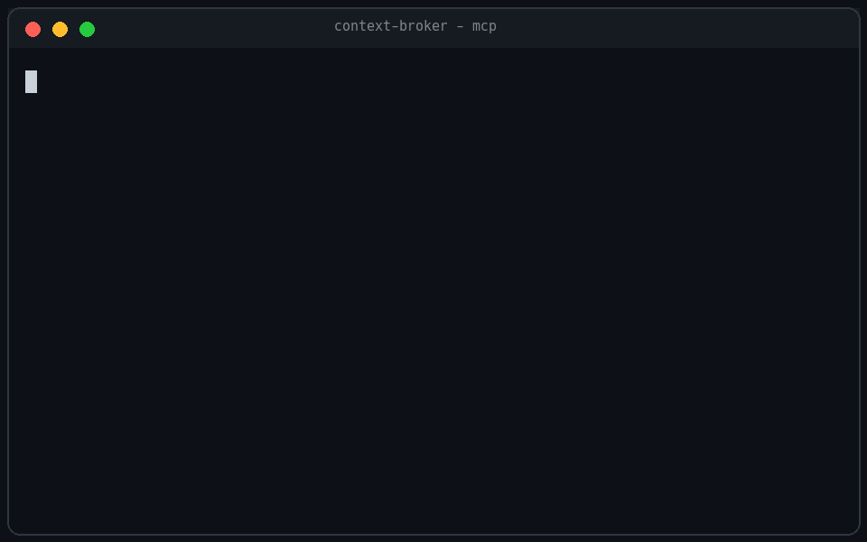
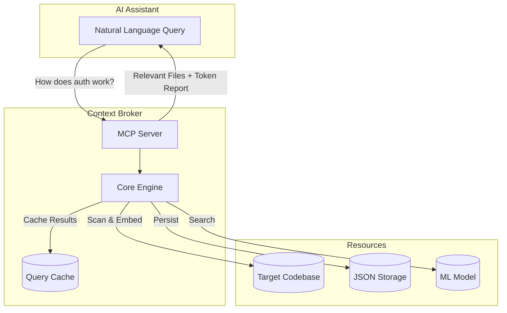
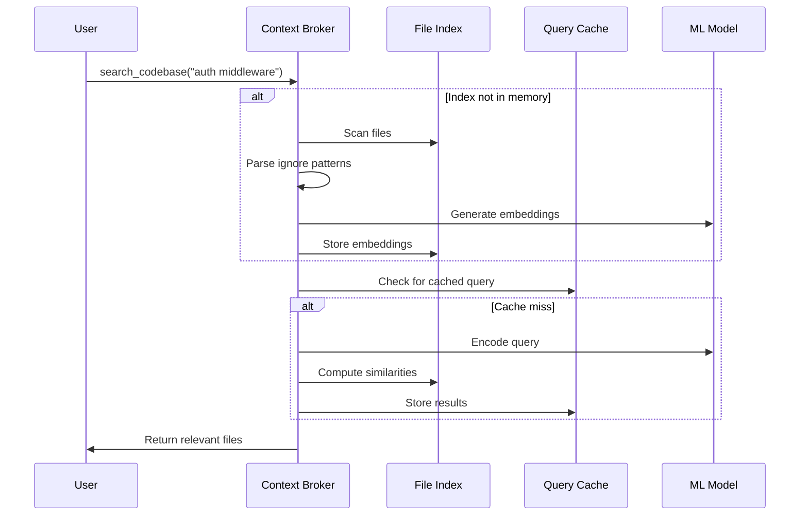

<div align="center">

# 🧠 Context Broker

**Give your AI agent a photographic memory of your codebase.**

Semantic search + persistent cross-chat context + token-slim routing for Claude Code, Cursor, Codex, and any MCP client — 100% local, no API keys, no cloud. Finds relevant code by meaning, remembers decisions across sessions, and cuts token costs by 80–95%.

[](https://github.com/InSelfControll/context-broker-mcp/stargazers)
[](LICENSE)
[](pyproject.toml)
[](https://modelcontextprotocol.io)
[](https://github.com/jlowin/fastmcp)
[](https://docs.astral.sh/uv/)



**Works with:** Claude Code · Claude Desktop · Cursor · Codex CLI · Hermes Agent · Kimi CLI · Relayhelm

[🚀 Quick Start](#-quick-start) · [✨ Features](#-features) · [🧰 Tools](#-available-tools) · [📖 Docs](#-documentation) · [🤝 Contributing](#-contributing)

</div>

---

## 🎯 Why Context Broker?

AI coding assistants burn tokens reading whole files — or worse, your whole repo — just to answer one question. **Context Broker is a Model Context Protocol (MCP) server that fixes this**: it semantically indexes your codebase locally and sends only the relevant snippets, with a token report on every query.

| | Without Context Broker | With Context Broker |
|---|---|---|
| Context sent for "how does auth work?" | Entire files / repo dumps (~50,000 tokens) | Focused snippets only (~3,500 tokens) |
| Token cost per question | 💸 Full price | ✅ **Typically 80–95% saved** |
| Setup | — | One line in your MCP config |
| Privacy | Depends on tooling | 🔒 Fully local — embeddings never leave your machine |
| Memory across chats / models | ❌ None | ✅ Built-in (Redis / Honcho / local JSON) |

If you're looking for a **semantic code search MCP server**, a way to **reduce LLM token usage and context-window bloat**, **local RAG for codebases**, or a **context-optimization layer for Claude Code, Cursor, and Codex** — this is it.

### ⭐ Why star this repo?

- 🧠 **Cross-session memory** — Switch from Claude to GPT-4 without losing context (handoffs)
- ⚡ **Token-slim router** — Exposes only the tools needed for the task, not 40+ tools
- 🔒 **Local-first** — Runs on CPU, no cloud required, privacy-preserving
- 🤝 **Multi-agent delegation** — Splits large tasks across parallel workers safely
- 📊 **80–95% token savings** — Sends only relevant snippets, not entire files

**Star ⭐ this repo** if it saves you tokens — it helps other developers find it.

---

## ✨ Features

<table>
<tr>
<td width="50%">

### 🔍 Semantic Code Search
Find code by describing what you need in plain English — no exact file names required. Powered by local sentence-transformers embeddings (`all-MiniLM-L6-v2` by default, configurable).

### 💸 Token Efficiency Reports
Every query reports total project tokens vs. context sent vs. tokens saved — plus `token_counter` / `token_history` tools for dashboards.

### 🔀 Shared Service Across Agents
One `context-broker connect` per agent shares a single broker process, model, and cache pool across Codex, Claude Code, Cursor, Hermes, and more.

### 🧠 Cross-Chat Memory
`record_turn`, `record_session`, and `load_cross_session_context` persist conversation context to Redis, Honcho, or a local JSON ledger — and a web dashboard to browse it all.

</td>
<td width="50%">

### 🤝 Model Handoffs
`save_model_handoff` / `load_model_handoff` transfer immutable checkpoints (goal, decisions, failures, files) when you switch models mid-task — no provider API needed.

### 🧭 Token-Slim Router (UCR)
`route_task` ranks all tools against your task, applies a token budget, and exposes only the relevant slice — with safety gates that block injection, traversal, and dangerous commands.

### 🔐 Privacy-First by Design
Three-layer secret protection (indexing, I/O, search) blocks `.env` and credential files regardless of `.gitignore`. Hard-coded — not user-overridable.

### 🛠️ Repo Automation
Built-in tools generate and validate `AGENTS.md`, `CHANGELOG.md`, and feature docs from conventional commits.

</td>
</tr>
</table>

**Plus:** ⚡ CPU-optimized fast inference · 💾 smart caching with file-mtime tracking · 🚫 `.gitignore`/`.dockerignore` aware · 🗜️ disk embedding cache survives restarts · 🪦 auto-exits when the parent editor dies · 🧠 idle caches released after 15 min · 🌐 optional web dashboard

---

## 🚀 Quick Start

**Prerequisites:** Python 3.13+ and [uv](https://docs.astral.sh/uv/).

**Option 1: Install directly from GitHub (recommended)**

```bash
uv tool install https://github.com/InSelfControll/context-broker-mcp.git

# Or with extras
uv tool install "https://github.com/InSelfControll/context-broker-mcp.git[dashboard,integrations]"
```

**Option 2: Clone and install locally**

```bash
git clone https://github.com/InSelfControll/context-broker-mcp.git
cd context-broker
uv sync
```

Then add Context Broker to your MCP client — or let the CLI write the config for you:

```bash
context-broker integration-config --host claude-code --project-root /absolute/project
# also: --host codex | hermes | cursor | relayhelm
```

<details>
<summary><b>Manual client configuration</b> (Claude Desktop, Cursor, Kimi CLI, …)</summary>

```json
{
  "mcpServers": {
    "context-broker": {
      "command": "uv",
      "args": ["run", "python", "/full/path/to/context-broker/context-broker.py"],
      "env": {
        "CONTEXT_BROKER_PROJECT_ROOT": "/path/to/your/project"
      }
    }
  }
}
```

</details>

<details>
<summary><b>One shared broker for every coding agent</b> (recommended)</summary>

Point each agent's stdio MCP entry at:

```sh
context-broker connect --project-root /absolute/path/to/project
```

The first connection auto-starts the shared service; every agent reuses one embedding model and cache pool. Manage it explicitly:

```sh
context-broker start
context-broker stop    # disconnects every shared client
context-broker update --check
context-broker update
```

The service uses an OS-assigned port on `127.0.0.1`, an authenticated readiness check, and a startup lock, so concurrent agents never race. All clients must run as the same OS user; a private descriptor in `~/.cache/context-broker/service` holds the random bearer token (`CONTEXT_BROKER_SHARED_RUNTIME_DIR` relocates it). Each connection binds one canonical project root — requests cannot override it, and chat/session identifiers stay scoped per project. In shared mode, global JSON storage names include a project-path digest so equally named folders cannot collide; legacy name-only global saves are not auto-migrated.

The service owns one lazy embedding model and a single LRU cache pool for indexes, query metadata, and token reports. `CONTEXT_BROKER_MEMORY_POOL_MB` (default 256) bounds estimated retained cache payloads — **not** total RSS, the model, or in-flight work. Queries keep at most `CONTEXT_BROKER_QUERY_CACHE_MAX_ENTRIES` entries per project (128), disk query-cache files are capped by `CONTEXT_BROKER_QUERY_CACHE_MAX_FILE_BYTES` (4,000,000), and disk embedding caches use read-only memory maps. `get_memory_usage` reports aggregate pool counts and the shared PID without exposing another project's content.

For foreground operation, `serve` still defaults to port 8771 (`serve --port` selects another). Disabling one agent's MCP connection ends only its proxy; other sessions continue. A Linux startup-only measurement with the same interpreter showed 846,224 KiB peak RSS for the old eager import vs 79,044 KiB for proxy construction, before model loading — a startup measurement, not a production benchmark.

</details>

### Verify it works

```bash
uv run python context-broker.py
# [Broker] ⚡ Indexing new project: /your/project/path
# [Broker] ✅ Index ready. Total size: X tokens.
```

Then ask your assistant *"how does authentication work in this project?"* and watch for the tool call:

```
• Used search_codebase_tool ({"query": "auth middleware", ...})

📈 Token Efficiency Report:
   • Total Project Tokens: 50,000
   • Context Sent: 3,500
   • Tokens Saved: 46,500 (93.0%)
```

| Host | Configuration file | Notes |
| --- | --- | --- |
| [Claude Code](https://code.claude.com/docs/en/mcp) | `.mcp.json` → `mcpServers` | 600000 ms per-server timeout where supported |
| [Claude Desktop](https://modelcontextprotocol.io) | `claude_desktop_config.json` → `mcpServers` | Manual JSON config (see above) |
| [Cursor](https://cursor.com/docs/mcp) | `.cursor/mcp.json` → `mcpServers` | Host-managed elicitation/timeout |
| [Codex](https://developers.openai.com/codex/mcp/) | `.codex/config.toml` → `mcp_servers` | 600 s tool timeout; allow interactive MCP elicitation |
| [Hermes](https://hermes-agent.nousresearch.com/docs/user-guide/features/mcp) | `~/.hermes/config.yaml` → `mcp_servers` | 600 s tool timeout; form elicitation enabled |
| [Relayhelm](https://github.com/InSelfControll/relayhelm) | `~/.relayhelm/config.yaml` → `mcp_servers` | Project-bound shared service; form elicitation enabled |

Keep elicitation interactive: host hooks that auto-approve prompts defeat the intended human choice. If elicitation is unavailable, no delegation workers launch. Tests cover configuration parsing, real stdio/HTTP consent forwarding, failure propagation, shared-process identity, and project isolation. Native Codex, Claude Code, Cline, VS Code, DeepSeek, and Hermes applications were not launched in the test environment — the maintainer reports successful laptop use with Codex, Hermes, and Claude Code; Cursor native compatibility remains unverified.

---

## 🧰 Available Tools

<details open>
<summary><b>🔍 Search & Context</b></summary>

| Tool | Description |
|------|-------------|
| `search_codebase(query, project_root?)` | Semantic search over the codebase |
| `auto_search(project_root?)` | Auto-find entry points and configuration |
| `search_context(query, project_root?, top_k?)` | Search project context through the UCR public surface |
| `save_search_results` / `list_saved_results` / `load_saved_results` | Persist and reuse search results across sessions |
| `get_storage_config()` | Show storage configuration |

</details>

<details>
<summary><b>🧭 Token-Slim Router (UCR)</b></summary>

| Tool | Description |
|------|-------------|
| `route_task(task, mode?, token_budget?, top_k?)` | Recommend a minimal task-specific tool slice (`plan_only`, `recommend_tools`, `execute_safe`) |
| `execute_plan(plan_json, arguments_by_tool_json?, confirmed?)` | Execute/delegate a routed plan through safety gates |
| `explain_plan(plan_json)` | Explain a UCR plan in client-neutral JSON |
| `execute_selected_tool(tool_id, arguments_json?, confirmed?)` | Safety-gated execution/delegation for one router tool |
| `get_route_metrics()` | Route/execution/cache/latency metrics |
| `benchmark_router(iterations?)` | Lightweight in-process router benchmark |
| `token_counter(project_root?)` | Latest token usage for editor integrations |
| `token_history(project_root?, limit?)` | Graph-ready token savings history |
| `token_integration_manifest(project_root?)` | Integration options for GraphQL, LangGraph, etc. |

The router ranks tool descriptors against the current task, applies a token budget, and returns only the tools that should be visible. Registry vectors live in `.cache/token-slim-router-tools.json`. Safety checks block prompt-injection text, path traversal, secret-like arguments, secret filenames, and dangerous shell commands; high-risk and shell-capable tools require explicit confirmation. Unknown tools are delegated back to the client runtime, never executed blindly.

</details>

<details>
<summary><b>🧠 Cross-Chat Memory</b></summary>

| Tool | Description |
|------|-------------|
| `save_chat_context(...)` | Save chat messages to the context backend (Honcho or Redis) |
| `load_chat_context(...)` | Load cross-chat context |
| `record_turn(session_id, user_message, assistant_message, ...)` | Save one user–assistant exchange |
| `record_session(session_id, turns, ...)` | Bulk-persist an entire conversation |
| `context_backend_status()` | Show configured backend status |
| `load_cross_session_context(search_query?, top_k?, ...)` | Search across all sessions (Redis only) |
| `list_user_activity(peer_id?, limit?)` | Per-user activity audit (Redis only) |
| `save_model_handoff` / `load_model_handoff` | Immutable checkpoints when switching models |

Every save is dual-written to the chosen backend **and** a local-JSON ledger at `<storage>/chats/<project_digest>/<session_id>.json` — append-only, never overwritten. Saves invalidate then warm the default-params chat cache (`CONTEXT_BROKER_AUTO_WARM_CACHE_ON_SAVE=1`) so the next default load is an immediate hit. When `REDIS_URL` is set, full `load_chat_context` responses are cached with TTL `CONTEXT_BROKER_CHAT_CACHE_TTL_SECONDS` (default 300) for both backends.

</details>

<details>
<summary><b>🛠️ Repo Automation & Maintenance</b></summary>

| Tool | Description |
|------|-------------|
| `ensure_agents_md_tool` / `validate_agents_md_tool` / `generate_agents_md_tool` / `scan_projects_for_agents_md` | AGENTS.md lifecycle |
| `ensure_changelog_tool` / `validate_changelog_tool` / `generate_version_changelog` / `get_changelog_stats_tool` | CHANGELOG.md lifecycle from conventional commits |
| `ensure_feature_docs_tool` / `scan_missing_docs_tool` / `get_docs_stats_tool` | Feature documentation lifecycle |
| `check_environment(install_missing?, confirm?)` | Doctor: detect and (with confirmation) install anything missing |

**Resources:** `codebase://auto-context` (auto context per request) and `codebase://token-counter` (metrics for editor dashboards). Token counter reports persist under broker storage (`.context-broker/_internal/token-counter-latest.json`), which is excluded from semantic indexing.

</details>

---

## 🏗️ How It Works


```mermaid
flowchart TB
    subgraph "AI Assistant"
        AI["Natural Language Query"]
    end

    subgraph "Context Broker"
        MCP["MCP Server"]
        Core["Core Engine"]
        Cache[(Query Cache)]
    end

    subgraph "Resources"
        Codebase[(Target Codebase)]
        Storage[(JSON Storage)]
        Model[(ML Model)]
    end

    AI -->|"How does auth work?"| MCP
    MCP --> Core
    Core -->|"Scan & Embed"| Codebase
    Core -->|"Search"| Model
    Core -->|"Cache Results"| Cache
    Core -->|"Persist"| Storage
    MCP -->|"Relevant Files + Token Report"| AI
```

1. **Project detection** — finds the project root via `.git`, `pyproject.toml`, `package.json`, …
2. **File indexing** — single-pass `os.walk` (no symlink following by default), honoring `.gitignore` / `.dockerignore`, with hard ignores for bulky files (ISOs, VM disks, archives, media, dumps)
3. **Local embedding** — sentence-transformers on CPU (GPU via `CONTEXT_BROKER_DEVICE=cuda|mps`), disk-cached under `.cache/` so restarts skip re-encoding
4. **Cosine similarity search** — returns focused snippets, not full-file dumps
5. **Caching** — query results cached with file-mtime fingerprinting; idle caches released after 15 min

**Performance:** first search 1–5 s · cached searches <100 ms · ~100 MB base memory + ~1 MB per 100 files · typically 80–95% token savings.

<details>
<summary><b>Sequence diagram</b></summary>


```mermaid
sequenceDiagram
    participant User
    participant CB as Context Broker
    participant Index as File Index
    participant Cache as Query Cache
    participant Model as ML Model

    User->>CB: search_codebase("auth middleware")

    alt Index not in memory
        CB->>Index: Scan files
        CB->>CB: Parse ignore patterns
        CB->>Model: Generate embeddings
        CB->>Index: Store embeddings
    end

    CB->>Cache: Check for cached query

    alt Cache miss
        CB->>Model: Encode query
        CB->>Index: Compute similarities
        CB->>Cache: Store results
    end

    CB->>User: Return relevant files
```

</details>

---

## ⚙️ Configuration

All settings are environment variables (12-factor). The most useful ones:

| Variable | Description | Default |
|----------|-------------|---------|
| `CONTEXT_BROKER_PROJECT_ROOT` | Default project root | Auto-detected |
| `CONTEXT_BROKER_EMBEDDING_MODEL` | Sentence-transformers model | `all-MiniLM-L6-v2` |
| `CONTEXT_BROKER_DEVICE` | Torch device (`cpu`, `cuda`, `mps`) | `cpu` |
| `CONTEXT_BROKER_CONTEXT_BACKEND` | Cross-chat backend: `none`, `honcho`, `redis` | `none` |
| `CONTEXT_BROKER_REDIS_URL` | Redis URL for the context backend + chat cache | *(empty)* |
| `CONTEXT_BROKER_STORAGE_MODE` | `global`, `in-project`, or `both` | `both` |
| `CONTEXT_BROKER_UCR_PUBLIC_SURFACE_ONLY` | Expose only the minimal UCR router surface | `0` |
| `CONTEXT_BROKER_AUTH_TOKEN` | Bearer token required on WS transport and dashboard when set | *(empty)* |

<details>
<summary><b>Full environment variable reference</b></summary>

| Variable | Description | Default |
|----------|-------------|---------|
| `CONTEXT_BROKER_PROJECT_ROOT` | Default project root | Auto-detected |
| `CONTEXT_BROKER_DEFAULT_QUERY` | Default auto-context query | `"main entry point configuration setup"` |
| `CONTEXT_BROKER_STORAGE_MODE` | Storage mode: `global`, `in-project`, or `both` | `both` |
| `CONTEXT_BROKER_STORAGE_DIR` | Base directory for global storage | `~/.context-broker` |
| `CONTEXT_BROKER_EMBEDDING_MODEL` | Sentence-transformers model for embeddings | `all-MiniLM-L6-v2` |
| `CONTEXT_BROKER_DEVICE` | Torch device for the embedding model | `cpu` |
| `CONTEXT_BROKER_LOCAL_ONLY` | Prefer cache-only loading, with one bootstrap download if missing | `0` |
| `CONTEXT_BROKER_AUTO_LOAD_ENV` | Load the nearest `.env` file at startup | `1` |
| `CONTEXT_BROKER_LLM_MODEL` | Optional LLM model identifier (exposed to MCP clients) | *(empty)* |
| `CONTEXT_BROKER_LLM_BASE_URL` | Optional LLM API endpoint URL | *(empty)* |
| `CONTEXT_BROKER_LLM_API_KEY` | Optional LLM API key | *(empty)* |
| `CONTEXT_BROKER_ENABLE_PROGRESS_NOTIFICATIONS` | Per-call MCP progress updates | `0` |
| `CONTEXT_BROKER_EXIT_WHEN_PARENT_DIES` | Exit when the launching editor/AI process disappears | `1` |
| `CONTEXT_BROKER_PARENT_POLL_INTERVAL_SECONDS` | Orphan-process poll interval | `3` |
| `CONTEXT_BROKER_IDLE_RESOURCE_TIMEOUT_SECONDS` | Release in-memory caches after this idle time (`0` disables) | `900` |
| `CONTEXT_BROKER_IDLE_RESOURCE_CLEANUP_INTERVAL_SECONDS` | Idle cleanup check interval | `30` |
| `CONTEXT_BROKER_ROUTER_PLAN_CACHE_MAX_ENTRIES` | Max in-memory routing plans (`0` disables) | `128` |
| `CONTEXT_BROKER_INDEX_FOLLOW_SYMLINKS` | Follow symlinks while collecting files | `0` |
| `CONTEXT_BROKER_INDEX_MAX_FILE_BYTES` | Skip files larger than N bytes (`0` disables) | `2000000` |
| `CONTEXT_BROKER_INDEX_DISK_CACHE` | Persist corpus embeddings under `.cache/` | `1` |
| `CONTEXT_BROKER_CONTEXT_BACKEND` | `none`, `honcho`, or `redis` | `none` |
| `CONTEXT_BROKER_REDIS_URL` | Redis URL when backend is `redis` | *(empty)* |
| `CONTEXT_BROKER_REDIS_KEY_PREFIX` | Redis key prefix | `context-broker` |
| `CONTEXT_BROKER_CHAT_CACHE_TTL_SECONDS` | TTL for the Redis chat-payload cache (`0` disables) | `300` |
| `CONTEXT_BROKER_USE_ACCOUNT_NAME` | Use the OS account name as default user peer id | `0` |
| `CONTEXT_BROKER_ACCOUNT_NAME_OVERRIDE` | Explicit override for the resolved user peer id | *(empty)* |
| `CONTEXT_BROKER_DASHBOARD_HOST` | Dashboard bind host | `127.0.0.1` |
| `CONTEXT_BROKER_DASHBOARD_PORT` | Dashboard bind port | `8770` |
| `CONTEXT_BROKER_HONCHO_WORKSPACE_ID` | Honcho workspace id | `context-broker` |
| `CONTEXT_BROKER_HONCHO_SESSION_PREFIX` | Honcho session id prefix | `context-broker` |
| `CONTEXT_BROKER_HONCHO_CONTEXT_TOKENS` | Default Honcho context token budget | `2000` |
| `CONTEXT_BROKER_HONCHO_LIMIT_TO_SESSION` | Limit Honcho context/search to selected session | `1` |
| `CONTEXT_BROKER_UCR_PUBLIC_SURFACE_ONLY` | Minimal UCR public router surface only | `0` |
| `CONTEXT_BROKER_WORKTREE_SHARED_ROOT` | Share index/cache/storage across linked git worktrees | `1` |
| `CONTEXT_BROKER_REGEX_MAX_PATTERN_CHARS` | Max caller regex length for `find_in_codebase` | `2000` |
| `CONTEXT_BROKER_REGEX_MATCH_TIMEOUT_SECONDS` | Per-file regex timeout (ReDoS guard) | `2.0` |
| `CONTEXT_BROKER_AUTH_TOKEN` | Bearer token for WS transport and dashboard | *(empty)* |
| `CONTEXT_BROKER_ALLOW_UNAUTHENTICATED_BIND` | Permit non-loopback binds without `AUTH_TOKEN` | `0` |

By default, Context Broker uses half of available CPU cores for embedding/indexing. It exits when its launching host disappears and releases in-memory caches after prolonged idle periods, preventing orphaned MCP processes from consuming RAM.

</details>

### Models

Context Broker uses **one local ML model** — an embedding model, not a chat/LLM:

| Component | Model | Purpose | Configurable? |
|-----------|-------|---------|--------------|
| Embedding | `all-MiniLM-L6-v2` (sentence-transformers) | Code → vector embeddings | Yes — `CONTEXT_BROKER_EMBEDDING_MODEL` |
| Tokenizer | `cl100k_base` (tiktoken) | Token counts for efficiency reports | No |

- Runs **locally on CPU** by default; **no LLM or chat model is used**
- Downloads automatically on first use, then cached; lazy-loaded and auto-unloaded after 15 min idle
- `CONTEXT_BROKER_LOCAL_ONLY=1` tries the cache first, then performs one announced bootstrap download; explicit `HF_HUB_OFFLINE=1` / `TRANSFORMERS_OFFLINE=1` disable downloads entirely

| Alternative model | Quality | Speed | Size |
|-------|---------|-------|------|
| `all-MiniLM-L6-v2` (default) | Good | Fast | ~80 MB |
| `all-mpnet-base-v2` | Better | Slower | ~420 MB |
| `paraphrase-MiniLM-L3-v2` | Lower | Fastest | ~60 MB |

Optional `CONTEXT_BROKER_LLM_*` variables have no built-in effect by themselves; they let MCP clients discover an LLM endpoint (reported by `get_storage_config`) and configure the delegation workers below.

---

## 🧠 Memory, Handoffs & Delegation

<details>
<summary><b>Relevant issue history without session bloat</b></summary>

At setup, call `configure_history_indexing`. It asks the user **Index / No index** through MCP elicitation and saves the choice per project. Indexing is off until an explicit choice enables it; *No index* still reads saved history directly, and disabling indexing removes only the derived SQLite index — never original chats or handoffs.

`lookup_project_history(query)` checks the project's local chat ledgers and model handoffs for the current issue. Question-bearing routing/search MCP calls also check history automatically and append at most three relevant excerpts. Initialization, tool discovery, and unrelated questions do not preload project memory.

Similarity uses conservative keyword overlap (≥2 meaningful terms, 60% query-term coverage) — it detects repeated and lexically similar issues; it is not universal semantic matching. No provider calls or embedding model loads are required. History stays excluded from the source-code index, and secret-bearing excerpts are excluded.

Both modes scan at most 128 recent candidate files, 1 MB per file, and 2000 records per lookup; each excerpt is ≤2000 characters. Oversized or unreadable history produces `partial: true` — never interpret it as exhaustive. Records from other projects are never retrieved. A standalone MCP server cannot intercept questions a host does not send to it.

</details>

<details>
<summary><b>Share memory when switching models</b> (<code>save_model_handoff</code> / <code>load_model_handoff</code>)</summary>

`save_model_handoff` saves an immutable checkpoint; `load_model_handoff` restores it for any target model in the same project. Neither requires Redis, Honcho, or a provider API:

```json
{
  "goal": "Original user request",
  "messages": [{"role": "user", "content": "Exact conversation text"}],
  "decisions": ["Keep the existing public API"],
  "constraints": ["Use the user-selected model and reasoning level"],
  "facts": [],
  "tasks": [{"task": "Native verification", "status": "failed", "failure_reason": "Host unavailable"}],
  "acceptance_criteria": ["Regression tests pass"],
  "open_questions": []
}
```

Pass the returned `handoff_id` to the next model — it must load that checkpoint before continuing. Exact supplied messages, decisions, failures, and file contents are retained; no automatic summary replaces them. Failed tasks require reasons; completed tasks require evidence. Changed files, corruption, missing checkpoints, or insufficient context budget return `failed`; saved memory stays intact for recovery.

Checkpoints live once under `CONTEXT_BROKER_STORAGE_DIR/handoffs/<project-digest>/`, independently of model, session, and storage mode. Identical saves reuse the same content-hash ID; updated checkpoints preserve previous versions. Atomic writes and file locks protect concurrent saves. Each checkpoint is limited to 256 KB (source files share the 64 KB snapshot limit); load defaults to a 32 KB byte budget. These tools cannot recover unsaved host history, transfer private model reasoning, or guarantee equal model quality.

</details>

<details>
<summary><b>Optional multi-agent delegation for large tasks</b> (<code>delegate_large_task</code>)</summary>

`delegate_large_task` runs 2–4 independent proposal workers concurrently, then one integration reviewer, using the **exact user-specified model ID** for every call. The tool asks the user **Split task / Keep one agent** before any provider calls — decline, cancellation, timeout, or unavailable elicitation launches no workers, and there is no confirmation boolean that bypasses the prompt.

Configure `CONTEXT_BROKER_LLM_BASE_URL` (OpenAI-compatible, ending in `/v1`) and, if required, `CONTEXT_BROKER_LLM_API_KEY` on the broker service. Local HTTP is limited to loopback; remote endpoints require HTTPS. The provider must support `/chat/completions` JSON responses and return the requested exact model ID. Provider calls can incur charges; the confirmation states the assignments, selected model, context sharing, and maximum number of calls.

Workers have no command execution or file-writing tools — they return proposed changes, evidence, and risks. Passing review yields `ready_for_integration`, **not completed work**: the host must integrate proposals and run tests. Failed batches preserve successful proposal handoffs, cancel unfinished siblings, and never automatically retry paid calls. Files outside the project, secret files/content, oversized responses, incomplete provider responses, and model mismatches are rejected. Failures return `status: "failed"`, `failure_code`, `failure_reason`, `completed: false`, with the MCP `isError` flag set; provider HTTP failures expose only the status code.

</details>

<details>
<summary><b>Storage modes & persistence model</b></summary>

- **Query cache** → local JSON at `.cache/context-broker.json`
- **Corpus embedding index** → `.cache/context-broker-index.json` + `.npy` (invalidated by path set / mtime fingerprint / model name)
- **Saved results / user memory / token history** → local JSON under `.context-broker/` or `~/.context-broker/`
- **Cross-chat context** → optional Honcho or Redis backend
- **Chat history** → dual-written to the backend **and** `<storage>/chats/<project_digest>/<session_id>.json`

Three storage modes for saved JSON results:

1. **Both (default) ⭐** — save to the project folder, load project-first with global fallback, list from both. Best for daily development.
2. **Global** — everything under `~/.context-broker/`. Best for CI/CD and centralized management.
3. **In-project** — everything under the project's `.context-broker/`. Best for committing results to git and sharing with teammates.

</details>

<details>
<summary><b>Web dashboard & cross-chat backends</b></summary>

```bash
CONTEXT_BROKER_CONTEXT_BACKEND=redis \
CONTEXT_BROKER_REDIS_URL=redis://localhost:6379/0 \
python -m context_broker dashboard
```

Binds `127.0.0.1:8770` by default; install extras with `pip install "context-broker[dashboard]"`. The dashboard requires the Redis backend to enumerate projects, auto-loads the nearest `.env` (without overriding parent env), and re-running it when an instance is already serving is a clean no-op — safe to wire as an auto-launch step in every editor's MCP config. User identity is opt-in via `CONTEXT_BROKER_USE_ACCOUNT_NAME=1` (defaults to the OS account name; `CONTEXT_BROKER_ACCOUNT_NAME_OVERRIDE` overrides; explicit `user_peer_id` args always win).

Prefer Honcho? `CONTEXT_BROKER_CONTEXT_BACKEND=honcho` — install with `pip install "context-broker[integrations]"`. The same `save_chat_context` / `load_chat_context` tools then write to Honcho; context is session-limited by default to avoid mixing unrelated memory.

</details>

<details>
<summary><b>Disconnect behavior</b></summary>

On Linux, closing the editor's stdio MCP connection terminates the broker even when the editor remains open or a synchronous operation is still running — the watchdog observes pipe hangup without reading protocol messages. Network transports remain available to other clients when one disconnects.

Editor plugin enable/disable settings belong to the editor; this repository contains no editor plugin or hook that synchronizes those settings, and stopping the broker process does not change an editor's plugin toggle.

</details>

---

## 🌐 Universal Context Router

Context Broker is migrating incrementally into a **Universal Context Router**: an upstream MCP server plus a downstream MCP client (`context_broker/client_ttc/`) supporting stdio, streamable HTTP, and SSE transports with bounded reconnect, heartbeat probes, capability discovery, and downstream `tools/call` dispatch. The UCR runtime adds an expanded tool registry (JSON / SQLite / optional Redis), intent detection, skill-aware decomposition, DAG planning with parallel-safe stages, safety-gated execution, secret redaction, route metrics, and benchmarking — while existing tools stay backward compatible by default.

See [ARCHITECTURE_MIGRATION.md](ARCHITECTURE_MIGRATION.md) for completed work, remaining phases, decisions, risks, and rollback strategy. A standalone multi-provider/channel harness is feasible — see [docs/harness-feasibility.md](docs/harness-feasibility.md).

---

## 📖 Documentation

- [Usage Guide](Usage.md) — configuration, workflows, tool examples, best practices, troubleshooting
- [Architecture](ARCHITECTURE.md) — C4 diagrams, data flow, module dependencies, performance
- [Migration Plan](ARCHITECTURE_MIGRATION.md) — UCR migration status and roadmap
- [UCR RFCs](docs/rfc/README.md) — vendor-neutral RFC series (RFC-000 → RFC-018)
- [Example AGENTS.md](Example-AGENTS.md) — a well-structured, broker-generated `AGENTS.md`
- [Contributing](CONTRIBUTING.md) — development setup, code style, testing

## Project Structure

```
context-broker/
├── context_broker/              # Modular package (TTC pattern)
│   ├── config.py                # All env vars, constants, security patterns
│   ├── __main__.py              # Entry: MCP server or dashboard
│   ├── indexer_ttc/             # Embedding, indexing, search
│   ├── storage_ttc/             # JSON persistence
│   ├── context_ttc/             # Cross-chat context (Honcho/Redis), chat ledger
│   ├── dashboard_ttc/           # Starlette web dashboard
│   ├── security_ttc/            # Secret file protection, audit logging
│   ├── client_ttc/              # Downstream MCP client (UCR)
│   └── server_ttc/              # MCP tool registrations
├── pyproject.toml
├── README.md · Usage.md · ARCHITECTURE.md · CHANGELOG.md · AGENTS.md · CONTRIBUTING.md
```

**Supported file types:** Python, JavaScript, TypeScript, Go, Rust, Java, HTML, CSS, Shell, SQL, JSON, TOML, YAML, XML, Properties, Gradle, Markdown. Always-ignored directories include `node_modules`, `.git`, `dist`, `__pycache__`, `.venv`, `target`, `build`, `bin`, `out`, `.gradle`, `.idea`, `.vscode`, and more.

## Running Transports

```bash
uv run python context-broker.py                 # stdio (default)
CONTEXT_BROKER_TRANSPORT=sse \
CONTEXT_BROKER_PORT=8765 uv run python context-broker.py   # SSE (Docker-friendly)
CONTEXT_BROKER_TRANSPORT=streamable-http uv run python context-broker.py
```

---

## 🤝 Contributing

Contributions are welcome — see [CONTRIBUTING.md](CONTRIBUTING.md) for the developer guide. All changes need tests (`uv run pytest`) and follow the TTC pattern.

If Context Broker saved you tokens, **give it a ⭐** — and share it with someone whose AI assistant is still reading entire repos.

## License

[MIT](LICENSE) · Built with [FastMCP](https://github.com/jlowin/fastmcp) and [sentence-transformers](https://sbert.net)
