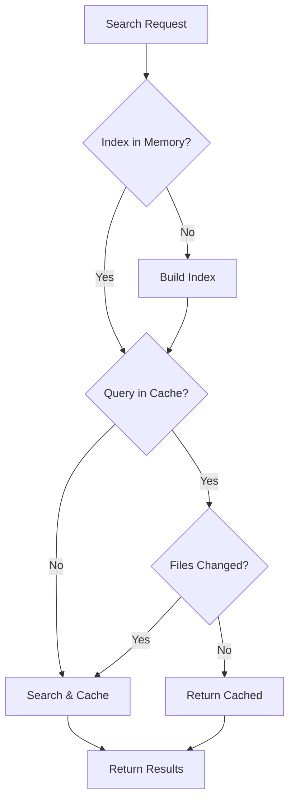

# Context Broker MCP Server - Usage Guide

## Table of Contents

1. [Overview](#overview)
2. [Installation](#installation)
3. [Configuration](#configuration)
4. [Storage Modes](#storage-modes)
5. [Available Tools](#available-tools)
6. [Use Cases & Workflows](#use-cases--workflows)
7. [How It Works](#how-it-works)
8. [Best Practices](#best-practices)
9. [Troubleshooting](#troubleshooting)
10. [API Reference](#api-reference)

---

## Overview

Context Broker is a Model Context Protocol (MCP) server that provides semantic search capabilities for your codebase. It uses sentence transformers to understand the meaning of your code and find relevant files based on natural language queries.

### Key Features

| Feature | Description | Benefit |
|---------|-------------|---------|
| **Semantic Search** | Find code by describing what you need | No need to remember exact file names |
| **Auto-Project Detection** | Automatically detects project roots | Zero configuration required |
| **Smart Caching** | Caches search results with file modification tracking | Fast repeat queries |
| **Token Efficiency** | Reports token usage and savings | Optimize context window usage |
| **Multi-Mode Storage** | Global, in-project, or both storage modes | Flexible data persistence |
| **Respects Ignore Files** | Reads `.gitignore` and `.dockerignore` | Keeps results relevant |

---

## Installation

### Prerequisites

- Python 3.13 or higher
- UV package manager (recommended)

### Setup

```bash
# Clone or navigate to the project directory
cd /path/to/context-broker

# Install dependencies using UV
uv sync
```

Or with pip:
```bash
pip install -e .
```

---

## Configuration

### Environment Variables

| Variable | Description | Default | Options |
|----------|-------------|---------|---------|
| `CONTEXT_BROKER_PROJECT_ROOT` | Default project root path | Auto-detected from CWD | Any valid path |
| `CONTEXT_BROKER_DEFAULT_QUERY` | Default query for auto-context | `"main entry point configuration setup"` | Any string |
| `CONTEXT_BROKER_STORAGE_MODE` | Storage mode | `both` | `global`, `in-project`, `both` |
| `CONTEXT_BROKER_STORAGE_DIR` | Base directory for global storage | `~/.context-broker` | Any valid path |

### MCP Client Configuration

Add the server to your MCP client configuration:

#### Claude Desktop

Edit `~/Library/Application Support/Claude/claude_desktop_config.json` (macOS) or equivalent:

```json
{
  "mcpServers": {
    "context-broker": {
      "command": "uv",
      "args": ["run", "--with", "fastmcp", "python", "/path/to/context-broker.py"],
      "env": {
        "CONTEXT_BROKER_PROJECT_ROOT": "/path/to/your/project"
      }
    }
  }
}
```

#### Kimi CLI

Add to your Kimi CLI configuration:

```json
{
  "mcpServers": {
    "context-broker": {
      "command": "uv",
      "args": ["run", "--with", "fastmcp", "python", "/path/to/context-broker.py"]
    }
  }
}
```

---

## Storage Modes

The MCP server supports three storage modes for saving JSON search results.

### Storage Mode Comparison

| Mode | Write Location | Read Priority | Best Use Case |
|------|---------------|---------------|---------------|
| `both` (default) | Local project | Local → Global | Daily development |
| `global` | `~/.context-broker/` | Global only | CI/CD, centralized |
| `in-project` | `{project}/.context-broker/` | Local only | Team collaboration |

### 1. Both Mode (Default) ⭐ Recommended

Uses both storage locations, **preferring local project storage**.

**Behavior:**
- **Save:** Always saves to local project folder (`.context-broker/`)
- **Load:** Checks local project first, falls back to global if not found
- **List:** Shows files from both locations with indicators

**Directory Structure:**
```
/path/to/my-api-project/              ~/.context-broker/
├── src/                              └── my-api-project/
├── .context-broker/                      ├── api/
│   └── api/                              │   └── legacy-results.json
│       └── auth-middleware.json          └── config/
└── package.json                              └── database.json
```

**When to Use:**
- ✅ Daily development across multiple projects
- ✅ You want results to travel with your project
- ✅ Need a global fallback for shared/common queries
- ✅ Working with both personal and work projects

**Configuration:**
```bash
# Default - no need to set
CONTEXT_BROKER_STORAGE_MODE=both
```

### 2. Global Mode

Stores all project data in a centralized location:

**Directory Structure:**
```
~/.context-broker/
├── my-api-project/
│   ├── api/
│   │   ├── auth-routes.json
│   │   └── middleware.json
│   └── config/
│       └── database.json
├── my-web-app/
│   └── frontend/
│       └── components.json
└── shared/
    └── common-patterns.json
```

**When to Use:**
- ✅ CI/CD environments
- ✅ You don't want extra folders in projects
- ✅ Centralized backup and management
- ✅ Shared development machines

**Configuration:**
```json
{
  "mcpServers": {
    "context-broker": {
      "command": "uv",
      "args": ["run", "--with", "fastmcp", "python", "/path/to/context-broker.py"],
      "env": {
        "CONTEXT_BROKER_STORAGE_MODE": "global",
        "CONTEXT_BROKER_STORAGE_DIR": "/shared/storage/context-broker"
      }
    }
  }
}
```

### 3. In-Project Mode

Stores data only within each project's directory:

**Directory Structure:**
```
/path/to/my-api-project/
├── src/
├── .context-broker/          # Auto-created by MCP
│   ├── api/
│   │   └── auth-middleware.json
│   ├── config/
│   │   └── database.json
│   └── README.md             # Documentation about saved searches
├── package.json
├── .gitignore                # Should include .context-broker/
└── README.md
```

**When to Use:**
- ✅ Team collaboration (commit results to git)
- ✅ Onboarding new developers
- ✅ Preserving context for future reference
- ✅ Documentation purposes

**Configuration:**
```json
{
  "mcpServers": {
    "context-broker": {
      "command": "uv",
      "args": ["run", "--with", "fastmcp", "python", "/path/to/context-broker.py"],
      "env": {
        "CONTEXT_BROKER_STORAGE_MODE": "in-project"
      }
    }
  }
}
```

**Note:** Add `.context-broker/` to your `.gitignore` if you don't want to commit search results:
```gitignore
# Context Broker search results
.context-broker/
```

---

## Available Tools

### `search_codebase`

Search your codebase using semantic similarity.

**Parameters:**
| Parameter | Type | Required | Description |
|-----------|------|----------|-------------|
| `query` | string | ✅ Yes | Search query describing what you're looking for |
| `project_root` | string | ❌ No | Project root path - auto-detected if not provided |

**Example:**
```
search_codebase(
    query="authentication middleware with JWT",
    project_root="/path/to/api-project"
)
```

**Returns:** Relevant file contents with token statistics.

**Example Output:**
```
🔍 Search Results for: 'authentication middleware with JWT'
📁 Project: my-api-project
📊 Found 5 relevant files (out of 127 total)

============================================================

### FILE: /path/to/auth.py
def validate_jwt_token(token: str) -> dict:
    """Validate a JWT token and return payload."""
    ...
```

---

### `auto_search`

Automatically search for main entry points, configuration, and setup files.

**Parameters:**
| Parameter | Type | Required | Description |
|-----------|------|----------|-------------|
| `project_root` | string | ❌ No | Project root path - auto-detected if not provided |

**When to Use:**
- First time exploring a new project
- Need to understand project structure
- Looking for configuration files and architecture

**Example:**
```
auto_search(project_root="/path/to/new-project")
```

---

### `save_search_results`

Search the codebase and save results to a JSON file.

**Parameters:**
| Parameter | Type | Required | Description |
|-----------|------|----------|-------------|
| `query` | string | ✅ Yes | Search query describing what you're looking for |
| `filename` | string | ✅ Yes | Name for the JSON file (e.g., "auth-middleware.json") |
| `project_root` | string | ❌ No | Project root path - auto-detected |
| `subdir` | string | ❌ No | Subdirectory (e.g., "api", "config", "auth") |
| `top_k` | integer | ❌ No | Number of results to include (default: 5) |

**Storage Locations by Mode:**
- **Global mode:** `~/.context-broker/{project}/{subdir}/{filename}`
- **In-project mode:** `{project-root}/.context-broker/{subdir}/{filename}`
- **Both mode:** Saves to local project, checks local first on load

**Example:**
```
save_search_results(
    query="authentication middleware JWT token validation",
    filename="auth-middleware.json",
    subdir="api",
    top_k=5
)
```

**Returns:** Path to saved file.

---

### `list_saved_results`

List all saved JSON results for a project.

**Parameters:**
| Parameter | Type | Required | Description |
|-----------|------|----------|-------------|
| `project_name` | string | ✅ Yes | Name of the project |
| `subdir` | string | ❌ No | Subdirectory to list |
| `project_root` | string | ❌ No | Required for in-project storage mode |

**Example:**
```
list_saved_results(
    project_name="my-api-project",
    subdir="api"
)
```

**Returns:** List of saved files with storage locations.

---

### `load_saved_results`

Load previously saved search results.

**Parameters:**
| Parameter | Type | Required | Description |
|-----------|------|----------|-------------|
| `project_name` | string | ✅ Yes | Name of the project |
| `filename` | string | ✅ Yes | Name of the saved JSON file |
| `subdir` | string | ❌ No | Subdirectory |
| `project_root` | string | ❌ No | Required for in-project storage mode |

**Loading Priority (Both Mode):**
1. Check local project folder first
2. If not found, check global storage
3. Return the first match found

**Example:**
```
load_saved_results(
    project_name="my-api-project",
    filename="auth-middleware.json",
    subdir="api"
)
```

**Returns:** The saved search results with file contents.

---

### `get_storage_config`

Get the current storage configuration.

**No parameters required.**

**Returns:** Current storage mode, base directory, and folder structure information.

**Example Output:**
```
📦 Context Broker Storage Configuration

Current Mode: both

Available Modes:
  • 'global'   - Store only in centralized location
  • 'in-project' - Store only in project folder
  • 'both'     - Use both, prefer local project (DEFAULT)

Storage Locations:
  Global:      ~/.context-broker/{project-name}/{subdir}/
  In-project:  {project-root}/.context-broker/{subdir}/
```

---

## Use Cases & Workflows

### Use Case 1: Daily Development (Both Mode)

**Scenario:** Working on multiple projects daily, need context that follows your code.

**Setup:**
```bash
# Default configuration - no special setup needed
```

**Workflow:**
```
1. auto_search()                    # Get project overview
2. save_search_results(             # Save important findings
     query="user authentication flow",
     filename="auth-flow.json",
     subdir="docs"
   )
3. search_codebase(                 # Search for specific code
     query="password hashing bcrypt"
   )
4. load_saved_results(              # Refer back to saved context
     project_name="my-project",
     filename="auth-flow.json",
     subdir="docs"
   )
```

**Benefits:**
- Results saved in project folder for easy access
- Global storage acts as backup
- Easy to share context with teammates

---

### Use Case 2: Team Onboarding (In-Project Mode)

**Scenario:** New developer joining the team, needs to understand the codebase quickly.

**Setup:**
1. Configure MCP with `CONTEXT_BROKER_STORAGE_MODE=in-project`
2. Don't add `.context-broker/` to `.gitignore`

**Team Lead Workflow:**
```
1. auto_search()                                    # Discover architecture
2. save_search_results(
     query="main entry points and routing",
     filename="architecture-overview.json",
     subdir="onboarding"
   )
3. save_search_results(
     query="database models and relationships",
     filename="database-schema.json",
     subdir="onboarding"
   )
4. save_search_results(
     query="authentication and authorization",
     filename="auth-system.json",
     subdir="onboarding"
   )
5. Commit .context-broker/onboarding/ to git
```

**New Developer Workflow:**
```
1. git clone <repo>                     # Gets onboarding docs
2. load_saved_results(
     project_name="our-project",
     filename="architecture-overview.json",
     subdir="onboarding"
   )
3. Ask questions based on the context
```

**Benefits:**
- Context travels with the codebase
- New team members get curated documentation
- Search results are version controlled

---

### Use Case 3: CI/CD & Automation (Global Mode)

**Scenario:** Automated documentation generation in CI/CD pipelines.

**Setup:**
```json
{
  "mcpServers": {
    "context-broker": {
      "command": "uv",
      "args": ["run", "--with", "fastmcp", "python", "/path/to/context-broker.py"],
      "env": {
        "CONTEXT_BROKER_STORAGE_MODE": "global",
        "CONTEXT_BROKER_STORAGE_DIR": "/ci/storage/context-broker"
      }
    }
  }
}
```

**CI/CD Workflow:**
```bash
#!/bin/bash
# .github/workflows/docs.yml

# 1. Index the codebase
kimi-mcp call context-broker auto_search

# 2. Save key architectural documents
kimi-mcp call context-broker save_search_results \
    '{"query": "API endpoints and controllers", "filename": "api-docs.json", "subdir": "generated"}'

kimi-mcp call context-broker save_search_results \
    '{"query": "database migrations and schema", "filename": "schema-docs.json", "subdir": "generated"}'

# 3. Publish docs (custom script)
./scripts/publish-docs.sh /ci/storage/context-broker/${PROJECT_NAME}/
```

**Benefits:**
- Centralized storage across CI runs
- No pollution of project directories
- Easy backup and archival

---

### Use Case 4: Complex Feature Development

**Scenario:** Working on a complex feature spanning multiple parts of the codebase.

**Workflow:**
```
# Phase 1: Discovery
1. auto_search()
2. save_search_results(
     query="payment processing flow",
     filename="payment-flow-v1.json",
     subdir="features/payment-refactor"
   )

# Phase 2: Deep Dive
3. search_codebase(query="stripe integration webhook handling")
4. save_search_results(
     query="stripe webhook handlers",
     filename="stripe-webhooks.json",
     subdir="features/payment-refactor"
   )

# Phase 3: Implementation (next day)
5. load_saved_results(
     project_name="my-project",
     filename="payment-flow-v1.json",
     subdir="features/payment-refactor"
   )
6. Continue implementation with full context

# Phase 4: Documentation
7. list_saved_results(
     project_name="my-project",
     subdir="features/payment-refactor"
   )
8. Create PR description using saved context
```

**Benefits:**
- Context persists across sessions
- Organize searches by feature/subdir
- Easy to review and document

---

### Use Case 5: Debugging & Investigation

**Scenario:** Investigating a bug that spans multiple files.

**Workflow:**
```
# Step 1: Initial investigation
1. search_codebase(query="error handling in payment service")

# Step 2: Save relevant context
2. save_search_results(
     query="payment error handlers and logging",
     filename="payment-errors.json",
     subdir="debug/2024-01-15"
   )

# Step 3: Look for related code
3. search_codebase(query="transaction rollback database")
4. save_search_results(
     query="database transaction management",
     filename="transaction-handling.json",
     subdir="debug/2024-01-15"
   )

# Step 4: Review all findings
5. list_saved_results(
     project_name="my-project",
     subdir="debug/2024-01-15"
   )

# Step 5: Load and analyze
6. load_saved_results(
     project_name="my-project",
     filename="payment-errors.json",
     subdir="debug/2024-01-15"
   )
```

**Benefits:**
- Keep investigation organized by date/issue
- Share findings with team
- Reference in bug reports

---

### Use Case 6: Multi-Project Development

**Scenario:** Working on microservices or multiple related projects.

**Setup:**
```json
{
  "mcpServers": {
    "context-broker": {
      "command": "uv",
      "args": ["run", "--with", "fastmcp", "python", "/path/to/context-broker.py"],
      "env": {
        "CONTEXT_BROKER_STORAGE_MODE": "both"
      }
    }
  }
}
```

**Workflow:**
```
# Project A: API Gateway
1. auto_search(project_root="/work/api-gateway")
2. save_search_results(
     query="route configuration and middleware",
     filename="routes.json",
     subdir="api",
     project_root="/work/api-gateway"
   )

# Project B: User Service
3. auto_search(project_root="/work/user-service")
4. save_search_results(
     query="user model and authentication",
     filename="user-auth.json",
     subdir="models",
     project_root="/work/user-service"
   )

# Cross-service investigation
5. search_codebase(
     query="JWT token validation",
     project_root="/work/api-gateway"
   )
6. search_codebase(
     query="JWT token generation",
     project_root="/work/user-service"
   )
```

**Benefits:**
- Each project maintains its own context
- Easy to switch between projects
- Global storage provides unified view

---

## How It Works

### System Architecture

```mermaid
flowchart TB
    subgraph "Indexing Pipeline"
        A[Scan Files] --> B[Parse Ignores]
        B --> C[Filter Files]
        C --> D[Generate Embeddings]
        D --> E[Store in Memory]
    end
    
    subgraph "Search Pipeline"
        F[Receive Query] --> G[Check Cache]
        G -->|Cache Miss| H[Encode Query]
        H --> I[Compute Similarity]
        I --> J[Rank Results]
        J --> K[Update Cache]
        G -->|Cache Hit| L[Return Cached]
        K --> M[Return Results]
        L --> M
    end
    
    subgraph "Storage Pipeline"
        N[Save Request] --> O[Format JSON]
        O --> P[Route by Mode]
        P --> Q[Global Storage]
        P --> R[Local Storage]
    end
```



### Project Root Detection

The server detects project roots by looking for these markers (in order of priority):

1. **Highest Priority (100 points):**
   - `.git` - Git repository

2. **High Priority (50 points):**
   - `pyproject.toml` - Python projects
   - `package.json` - Node.js projects
   - `Cargo.toml` - Rust projects
   - `go.mod` - Go projects

3. **Medium Priority (10-40 points):**
   - `pom.xml`, `build.gradle` - Java projects
   - `CMakeLists.txt` - C/C++ projects
   - `setup.py`, `requirements.txt` - Python
   - `Makefile`, `Dockerfile`, `docker-compose.yml`
   - `.gitignore`, `README.md`, `LICENSE`

The directory with the highest score is selected as the project root.

### File Indexing

When a project is first accessed:

1. Scans for files with supported extensions
2. Respects `.gitignore` and `.dockerignore` patterns
3. Each file is embedded using `all-MiniLM-L6-v2` model
4. Results are cached for faster subsequent queries

### Caching Strategy



Search results are cached in `.cache/context-broker.json`:
- Stores file paths from previous searches
- Tracks file modification times (mtimes)
- Invalidates entries when files change

---

## Best Practices

### 1. Organize Saved Results

Use subdirectories to organize saved results:
```
.context-broker/
├── api/                    # API-related searches
├── auth/                   # Authentication searches  
├── config/                 # Configuration searches
├── features/
│   ├── feature-x/         # Feature-specific context
│   └── feature-y/
└── debug/
    └── 2024-01-15/        # Time-based investigation
```

### 2. Use Descriptive Filenames

**Good:**
- `jwt-authentication-middleware.json`
- `database-user-model.json`
- `stripe-webhook-handlers.json`

**Bad:**
- `search1.json`
- `results.json`
- `temp.json`

### 3. Leverage Both Mode

The default "both" mode gives you:
- Local storage for active development
- Global storage for backup and cross-project queries

### 4. Clean Up Old Results

Periodically review and clean up:
```bash
# List all saved results
ls -la ~/.context-broker/my-project/

# Remove old debug sessions
rm -rf ~/.context-broker/my-project/debug/2023-*
```

### 5. Use Specific Queries

Better results with specific queries:
- ✅ "JWT token validation middleware"
- ❌ "authentication"

---

## Troubleshooting

### "No files found in [path]"

- Check that the project root contains supported file types
- Verify files aren't in ignored directories
- Ensure the project path is correct

### Slow Initial Indexing

- First search on a large project may take time (30-60 seconds for 1000+ files)
- Subsequent searches use cached embeddings
- Consider excluding large directories in `.gitignore`

### Storage Issues

**Can't save results:**
- Check write permissions to project directory (in-project mode)
- Check write permissions to `~/.context-broker/` (global mode)

**Can't load results:**
- Verify storage mode matches where files were saved
- Check `get_storage_config()` for current configuration
- Ensure `project_root` is provided for in-project mode

### Outdated Results

- Cache automatically invalidates when files change
- Delete `.cache/context-broker.json` to force re-indexing
- Use `save_search_results` to persist important queries

---

## API Reference

### Module Structure

| Module | Purpose | Key Functions |
|--------|---------|---------------|
| `config` | Configuration | Constants, environment variables |
| `utils` | Utilities | `log()`, `count_tokens()`, `get_cache_path()` |
| `project` | Project detection | `find_project_root()`, `should_ignore()` |
| `storage` | Persistence | `save_json_data()`, `load_json_data()` |
| `indexer` | Search | `search_codebase()`, `get_index_for_project()` |
| `server` | MCP server | `create_mcp_server()`, tools, resources |

### Data Types

**Search Result:**
```python
{
    "query": str,
    "project": str,
    "project_root": str,
    "results": List[{
        "path": str,
        "content": str,
        "similarity_score": float,
        "tokens": int,
    }],
    "total_files": int,
    "returned_files": int,
    "total_tokens": int,
    "context_tokens": int,
    "saved_tokens": int,
    "saved_percent": float,
    "from_cache": bool,
}
```

**Saved Result:**
```python
{
    "project": str,
    "project_root": str,
    "query": str,
    "storage_mode": str,
    "timestamp": str,
    "file_count": int,
    "files": List[{
        "path": str,
        "content": str,
    }],
    "statistics": {
        "total_tokens": int,
        "context_tokens": int,
        "saved_tokens": int,
        "saved_percent": float,
    }
}
```

---

## Summary

Context Broker provides a powerful semantic search interface for your codebase with flexible storage options:

| Mode | Best For | Pros | Cons |
|------|----------|------|------|
| **Both** | Daily development | Local + global backup | Slightly more complex |
| **Global** | CI/CD | Centralized, clean projects | Not portable |
| **In-Project** | Team collaboration | Version controlled | Clutters repo |

Choose the mode that fits your workflow and start searching!
